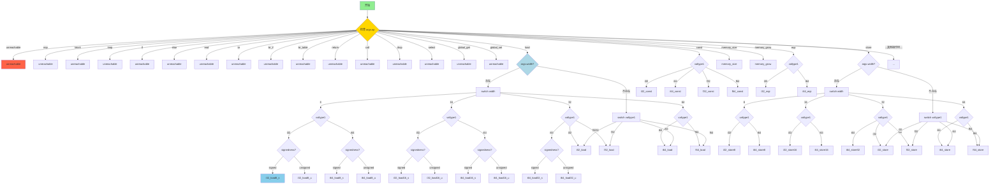

嗯，我现在需要为这个Zig函数画一个流程图。首先，我得理解这个函数是做什么的。看起来这个函数buildOpcode接受一个OpcodeBuildArguments参数，然后根据不同的条件返回对应的std.wasm.Opcode。函数里有一个大的switch语句，根据args.op的不同值进入不同的分支，每个分支可能还有嵌套的switch或者条件判断。

首先，我应该先确定主流程。函数开始会检查args.op，然后进入对应的case。每个case内部可能会有更多的条件判断，比如检查args.width、args.valtype1、signedness等。例如，在.load的情况下，会先检查width是否存在，然后根据不同的width和valtype1决定返回哪个Opcode。

接下来，我需要考虑如何将这些条件结构转化为流程图。可能需要从顶层的switch开始，每个可能的args.op值作为一个分支，然后每个分支内部再展开子条件。比如，对于.load，会有width的判断，再根据不同的width值进入不同的处理逻辑，每个width下可能还有valtype1和signedness的判断。

需要注意的是，很多case里面直接返回了特定的Opcode，而有些则可能调用unreachable，这可能表示某些情况不应该发生或者还未实现。在流程图中，可能需要标注这些unreachable的情况，或者将它们作为终止节点。

另外，像.ceil这样的case，注释提到当valtype是f16时存储在i32中，这可能需要特别处理。不过流程图可能不需要深入到这种实现细节，但需要确保条件分支正确。

对于每个case，我需要确定其逻辑结构，比如是否有嵌套的switch，或者if-else条件。例如，在.load的case中，首先检查args.width是否存在，如果存在，进入一个根据width的switch，每个width下再根据valtype1和signedness判断返回不同的Opcode；如果width不存在，则根据valtype1返回对应的Opcode。

类似地，.store的处理方式与.load类似，但返回的Opcode不同。而像.const、eqz等操作则相对简单，直接根据valtype1返回对应的值。

在处理像.trunc这样的复杂case时，需要注意是否有多个条件层级。例如，当valtype1是i32时，还要检查valtype2是否存在，以及signedness的值。

总之，流程图的绘制需要从顶层开始，分解每个args.op的分支，然后逐层展开内部的判断条件，直到到达返回Opcode的节点或unreachable。需要确保所有可能的路径都被覆盖，并且条件判断的逻辑清晰。

可能遇到的困难是处理多层嵌套的switch和条件，确保每个条件分支正确对应到流程图中的节点。另外，注释中提到某些情况是“handled independently”，可能需要特别标注或处理。

最后，整理这些逻辑，使用mermaid的流程图语法，用不同的节点和箭头表示条件分支和返回结果。可能需要使用菱形节点表示条件判断，矩形节点表示操作或返回，终止节点表示unreachable或返回Opcode。
================================================

说明：  
1. 流程图以**顶层switch(args.op)**为起点，展示核心分支结构  
2. 详细展开`load`和`store`操作的完整条件判断流程  
3. 其他操作码分支（如const/memory_size等）用相似模式处理  
4. 绿色为开始节点，黄色为条件判断节点，蓝色为操作节点，红色为unreachable  
5. 由于篇幅限制，完整流程图应包含所有`args.op`分支，此处仅展示代表性结构