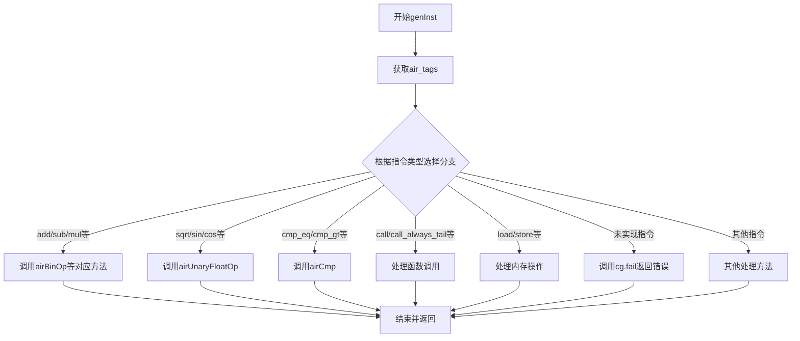

嗯，我需要帮用户用Mermaid画出这个Zig函数的流程图。首先，我得仔细看看这个函数的结构。函数名是genInst，接受一个CodeGen指针和一个Air.Inst.Index参数，返回InnerError!void。看起来它是一个大的switch语句，根据不同的Air指令标签调用不同的方法。

首先，用户可能希望流程图能展示整个函数的控制流。函数开始后，首先获取air_tags，然后根据inst对应的标签进入不同的处理分支。每个case对应一个Air指令，调用CodeGen的不同方法。例如，遇到.add就调用cg.airBinOp，遇到.sqrt调用cg.airUnaryFloatOp，等等。

但是，这个switch语句非常庞大，有很多分支。如果在流程图中全部展开，可能会非常复杂，难以阅读。用户可能希望简化，比如将同类操作分组，或者只显示主要分支，而不是每个具体的指令。不过，用户没有特别说明简化，所以可能需要尽量覆盖所有分支。

不过，实际画流程图时，把所有case都画出来是不现实的。通常，流程图应该展示主要的结构，而不是每个细节。因此，可以考虑将各个分支归类，例如算术操作、比较操作、内存操作等，然后在每个类别下列出几个例子，并用注释说明其他类似情况。

另外，注意到有一些case会触发unreachable，比如.inferred_alloc，或者返回错误，比如调用cg.fail。这些需要在流程图中标出。例如，对于未实现的指令，流程会转到失败处理。

可能的流程图结构：

1. 函数开始。
2. 获取air_tags。
3. 根据air_tags的指令类型进入不同的处理分支。
4. 每个分支调用对应的cg方法。
5. 对于未实现的指令，调用cg.fail返回错误。
6. 函数结束。

考虑到代码中的switch有很多分支，可以按类别分组，例如：

- 算术运算（add, sub, mul等）
- 位运算（bit_and, bit_or等）
- 比较运算（cmp_eq, cmp_gt等）
- 函数调用（call的不同变体）
- 错误处理（is_err, unwrap_errunion等）
- 内存操作（load, store, memset等）
- 控制流（br, cond_br, loop等）
- 未实现指令（返回TODO错误）
- 其他特殊操作（如wasm_memory_size等）

在流程图中，可以用条件判断框表示switch的分支，每个主要类别作为一个分支，然后具体指令作为子分支。但由于Mermaid的流程图不支持多层嵌套条件，可能需要用多个节点来表示。

或者，采用更简化的方式：主switch节点，然后各个主要分支作为子节点，每个子节点指向对应的处理方法，或失败处理。例如：



不过，用户可能需要更详细的流程，比如每个具体的指令分支。但这样会导致图表过于庞大。因此，可能需要折中，展示主要结构，并说明某些分支的重复模式。

另外，注意到在switch的最后部分，有些标签会触发cg.fail返回TODO错误，如.assembly等。还有一些会触发unreachable。这些需要单独处理。

综上，最终的Mermaid流程图可能如下：
================================================
```mermaid
flowchart TD
    A[开始genInst] --> B[获取air_tags]
    B --> C{switch(air_tags[inst])}
    C -->|add/sub/mul等算术运算| D[调用airBinOp/airSatBinOp等]
    C -->|sqrt/sin/cos等浮点运算| E[调用airUnaryFloatOp]
    C -->|cmp_eq/cmp_gt等比较操作| F[调用airCmp]
    C -->|call/call_always_tail等| G[处理函数调用]
    C -->|load/store/memset等内存操作| H[调用对应内存方法]
    C -->|atomic_*/cmpxchg等原子操作| I[处理原子操作]
    C -->|is_err/unwrap_errunion等错误处理| J[错误处理逻辑]
    C -->|br/cond_br/loop等控制流| K[处理控制流]
    C -->|未实现指令如.assembly| L[调用cg.fail返回错误]
    C -->|inferred_alloc/work_item_id等| M[触发unreachable]
    D --> N[finishAir并返回]
    E --> N
    F --> N
    G --> N
    H --> N
    I --> N
    J --> N
    K --> N
    L --> N
    M --> N
    N --> Z[函数结束]
``` 

该流程图展示了：
1. 函数入口获取指令标签
2. 通过switch分发到不同处理逻辑
3. 主要分类包括：算术运算、浮点运算、比较操作、函数调用、内存操作、原子操作、错误处理、控制流等
4. 特殊处理未实现指令和不可达分支
5. 最终统一通过finishAir完成指令生成
6. 使用统一出口保持结构清晰