嗯，我现在需要分析这个用Zig写的函数`lowerToCode`，并画出它的流程图。首先，我得理解这个函数是做什么的。看起来这是一个将中间表示（MIR）转换为WebAssembly字节码的函数。函数里有很多switch case处理不同的指令标签，比如`.block`, `.loop`, `.uav_ref`等等，每个case里生成相应的WASM指令。

首先，我需要理清函数的整体结构。函数开始处初始化了一些变量，比如`mir`、`code`、`wasm`等。然后进入一个循环，根据`tags[inst]`的值进行不同的处理。每个case处理完指令后，增加`inst`并继续循环。

接下来，流程图的结构应该是一个大的循环，每次迭代处理一个指令。每个指令对应不同的处理流程，比如生成操作码、处理参数、处理不同的内存操作等。可能的分支包括条件判断，比如`is_obj`决定不同的处理路径。

需要注意的是，这个函数使用了一个带标签的循环`loop: switch (tags[inst])`，然后在每个case里通过`continue :loop tags[inst]`来继续下一个指令的处理。这种结构在流程图中可能表现为一个循环结构，内部根据不同的指令类型分支。

另外，有些指令处理中会有panic("TODO")，说明这部分还未实现，可能需要特别标注。同时，像`is_wasm32`这样的条件判断也会导致不同的代码生成路径。

我需要确保流程图中包含所有主要的指令处理分支，包括内存操作、函数调用、原子操作、SIMD指令等。每个case的处理步骤可能需要简化为几个关键操作，比如生成操作码、写入参数、处理重定位等。

最后，流程图需要清晰地展示循环结构和各分支之间的跳转关系，可能使用子流程或条件判断节点来表示不同的处理路径。
================================================

```mermaid
graph TD
    A[开始] --> B[初始化变量: mir, code, wasm等]
    B --> C{循环处理指令}
    C --> D[获取当前指令tag]
    D -->|根据tag跳转| E[处理.dbg_epilogue_begin]
    D -->|根据tag跳转| F[处理.block/.loop]
    D -->|根据tag跳转| G[处理.uav_ref]
    D -->|根据tag跳转| H[处理.uav_ref_off]
    D -->|根据tag跳转| I[处理.nav_ref]
    D -->|根据tag跳转| J[处理.nav_ref_off]
    D -->|根据tag跳转| K[处理.func_ref]
    D -->|根据tag跳转| L[处理.dbg_line]
    D -->|根据tag跳转| M[处理.errors_len]
    D -->|根据tag跳转| N[处理.error_name_table_ref]
    D -->|根据tag跳转| O[处理br_if/br/memory_grow等]
    D -->|根据tag跳转| P[处理local_get/local_set]
    D -->|根据tag跳转| Q[处理br_table]
    D -->|根据tag跳转| R[处理call_nav]
    D -->|根据tag跳转| S[处理call_indirect]
    D -->|根据tag跳转| T[处理call_tag_name]
    D -->|根据tag跳转| U[处理call_intrinsic]
    D -->|根据tag跳转| V[处理global_set_sp]
    D -->|根据tag跳转| W[处理各类const指令]
    D -->|根据tag跳转| X[处理内存操作指令]
    D -->|根据tag跳转| Y[处理简单操作指令]
    D -->|根据tag跳转| Z[处理misc_prefix指令]
    D -->|根据tag跳转| AA[处理simd_prefix指令]
    D -->|根据tag跳转| AB[处理atomics_prefix指令]
    
    E --> AC[返回]
    F --> AD[写入block类型]
    G --> AE[根据is_obj分支处理]
    H --> AF[处理带偏移的uav引用]
    I --> AG[处理nav引用]
    J --> AH[处理带偏移的nav引用]
    K --> AI[生成函数引用]
    L --> AJ[跳过调试信息]
    M --> AK[写入错误数量]
    N --> AL[生成错误名称表引用]
    O --> AM[写入分支指令]
    P --> AN[处理局部变量操作]
    Q --> AO[处理跳转表]
    R --> AP[生成导航调用]
    S --> AQ[处理间接调用]
    T --> AR[生成标签名称调用]
    U --> AS[生成内置函数调用]
    V --> AT[设置栈指针全局变量]
    W --> AU[写入常量值]
    X --> AV[编码内存参数]
    Y --> AW[直接写入操作码]
    Z --> AX[处理扩展操作码]
    AA --> AY[处理SIMD指令]
    AB --> AZ[处理原子操作指令]
    
    AD --> C
    AE --> C
    AF --> C
    AG --> C
    AH --> C
    AI --> C
    AJ --> C
    AK --> C
    AL --> C
    AM --> C
    AN --> C
    AO --> C
    AP --> C
    AQ --> C
    AR --> C
    AS --> C
    AT --> C
    AU --> C
    AV --> C
    AW --> C
    AX --> C
    AY --> C
    AZ --> C
    
    C -->|所有指令处理完成| BA[结束]
``` 

流程图说明：
1. 函数入口初始化相关变量
2. 进入主循环处理每条MIR指令
3. 根据指令tag跳转到对应的处理分支
4. 每个分支完成特定指令的wasm字节码生成：
   - 写入操作码
   - 处理LEB128编码参数
   - 处理重定位信息
   - 处理内存地址参数
5. 每个分支处理后跳转回主循环继续下一条指令
6. 遇到`.dbg_epilogue_begin`时直接返回结束流程
7. 未实现的指令分支用panic("TODO")标记
8. 使用条件判断处理不同目标格式（is_obj）和架构（is_wasm32）的差异