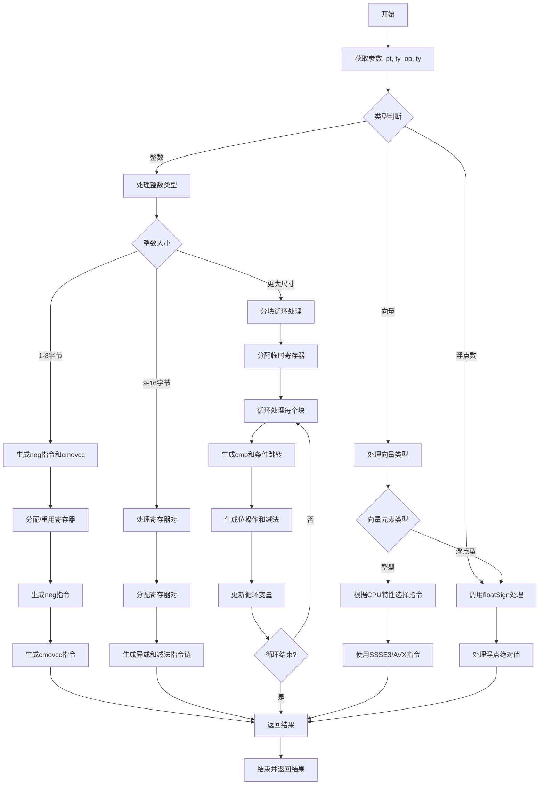

嗯，我现在需要为这个Zig函数`airAbs`画一个流程图。首先，我得理解这个函数的结构和逻辑。这个函数是用来生成计算绝对值的汇编指令的，对吧？看起来它处理不同类型的输入，比如整数、浮点数、向量等，并根据不同的情况生成不同的汇编代码。

首先，函数开始部分获取了一些参数，比如`ty_op`和`ty`，然后进入一个大的`switch`语句，根据类型的不同处理不同的情况。对于整数类型，根据大小（1-8字节，9-16字节，更大的情况）有不同的处理方式。对于浮点数和向量类型也有不同的处理分支。

我需要把整个函数的逻辑拆分成不同的步骤，然后画出每个步骤之间的流程。比如，当处理整数时，首先检查大小，如果是1-8字节，就生成对应的`cmovcc`指令；如果是9-16字节，则处理寄存器对；更大的话可能需要循环处理每个limb。然后对于浮点数和向量类型，调用其他函数如`floatSign`，或者根据支持的指令集（如AVX、SSSE3）选择不同的指令。

接下来，我需要考虑每个条件分支如何连接，比如`switch (ty.zigTypeTag(zcu))`下的各个case，以及每个case内部的流程。例如，当处理整数时，根据不同的`abiSize`进入不同的处理块，每个块内部可能有更多的条件判断，比如是否重用操作数寄存器，是否需要分配新的寄存器，生成不同的汇编指令等。

还要注意错误处理，比如`try`表达式可能导致的提前返回，但在这个函数中，似乎所有的错误处理都是通过`try`向上传递，所以在流程图中可能不需要特别标注错误路径，除非有显式的错误分支。

可能的结构是，从函数入口开始，根据类型判断分为几个大的分支，每个大分支内部再根据大小或其他特征细分。每个分支结束时可能会生成不同的MCValue（如寄存器、内存位置等），然后统一返回结果。

现在，我需要将这些逻辑步骤转化为流程图中的节点和判断框。可能需要用菱形表示条件判断，矩形表示处理步骤，箭头表示流程方向。例如：

开始 -> 获取ty_op和ty -> 判断类型是否为整数、浮点或向量 -> 根据不同路径处理 -> 生成对应汇编 -> 结束。

对于整数路径，再细分大小，每个大小对应不同的处理逻辑，比如1-8字节的处理包括生成neg指令和cmovcc，而更大的可能需要循环处理每个limb。每个子处理内部可能还有条件判断，比如是否重用寄存器，是否需要分配临时寄存器等。

在画流程图的时候，可能需要将复杂的条件分支拆分成多个层次，避免一个层次有过多的判断导致混乱。例如，先处理类型，然后在每个类型下处理大小，再在大小下处理具体操作。

另外，对于向量类型，处理逻辑可能依赖于CPU特性（如AVX、SSSE3等），这也需要作为条件判断节点。

最后，所有的路径都会汇聚到生成结果并返回。
================================================
