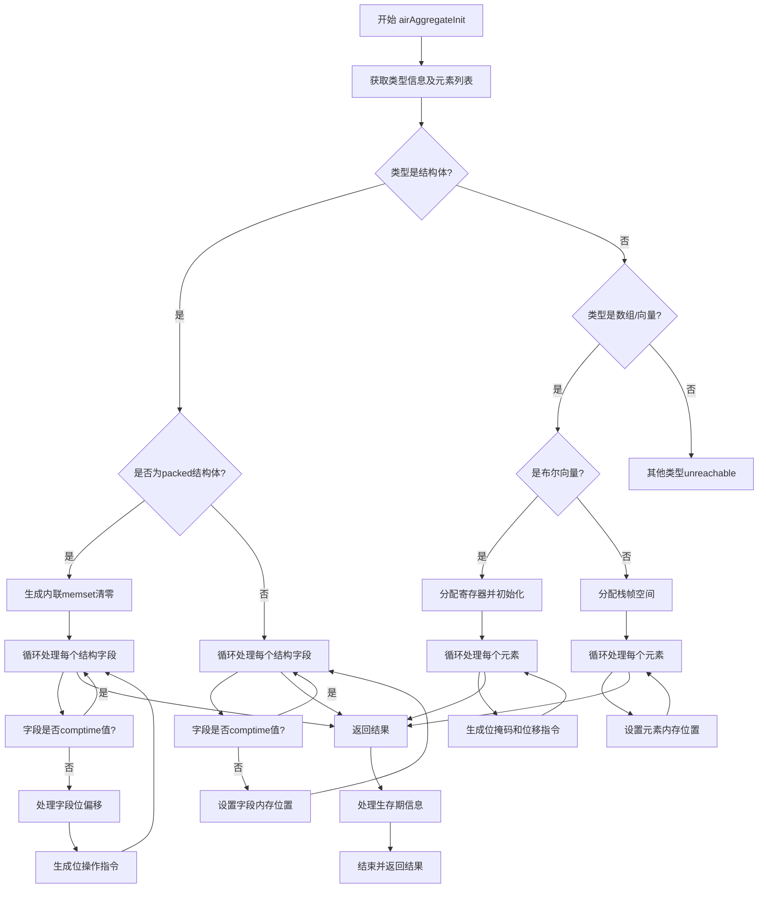

好的，我现在需要为提供的Zig函数`airAggregateInit`绘制流程图。首先，我需要理解这个函数的结构和逻辑。

函数的主要任务似乎是处理聚合类型的初始化，比如结构体、数组和向量。首先，函数获取一些类型信息，然后根据不同的类型执行不同的操作。对于结构体，如果是打包的（packed），会生成内联的memset，并逐个处理每个字段；否则，直接处理每个字段的偏移。对于数组和向量，如果是布尔类型的向量，则使用寄存器进行位操作，否则在栈帧上分配空间并设置每个元素的值。最后，函数处理返回结果并清理资源。

接下来，我需要将这些步骤分解成流程图中的各个节点和判断分支。可能的步骤包括：

1. 开始函数，获取类型信息和元素列表。
2. 判断类型是否为结构体、数组或向量。
3. 如果是结构体：
   - 检查是否为打包结构体。
   - 如果是，初始化内存，处理每个字段的位偏移和位操作。
   - 如果不是，直接处理每个字段的偏移。
4. 如果是数组或向量：
   - 检查是否是布尔向量，进行位操作。
   - 否则，分配栈帧空间，设置每个元素的值。
5. 处理结果，返回并清理资源。

需要注意的条件分支包括类型判断、是否打包结构体、元素类型是否为布尔等。此外，循环处理每个元素也是流程中的关键部分。

需要确保流程图的每个判断和操作步骤都清晰呈现，同时保持逻辑的正确性和连贯性。
================================================
