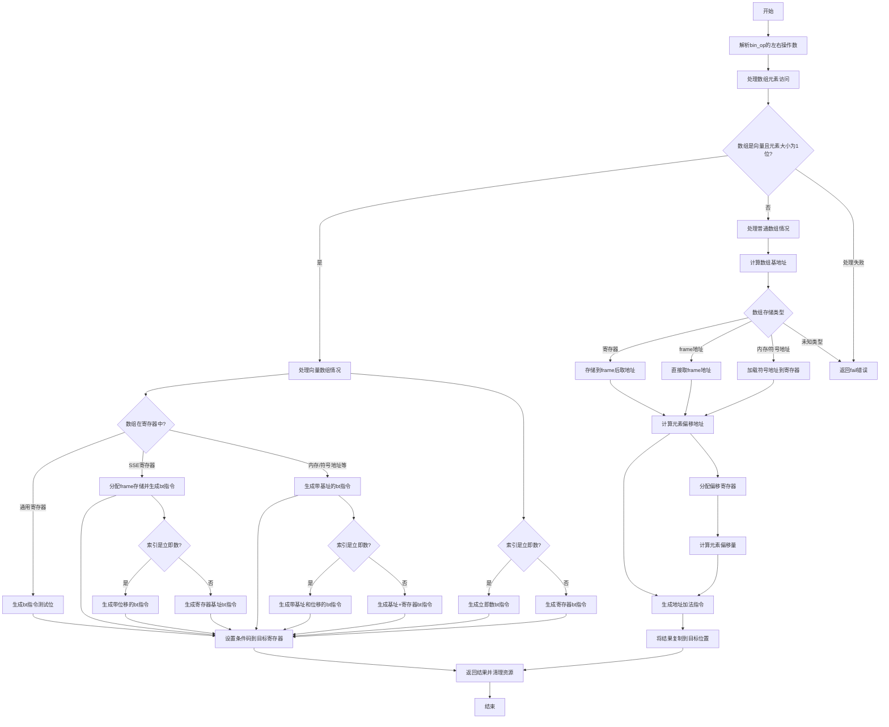

好的，我现在需要帮助用户用Mermaid画出给定Zig函数`airArrayElemVal`的流程图。首先，我需要仔细阅读并理解这个函数的逻辑。

这个函数的主要功能是处理数组元素的访问，根据不同的情况生成相应的机器码。函数开始时获取了一些操作数，然后根据数组类型和元素类型进行不同的处理。特别是处理向量数组和普通数组的情况，涉及到寄存器的分配、内存操作、位测试指令（bt）等。

首先，我需要将函数的整体结构分解成主要步骤。函数大致分为几个部分：

1. 解析指令的操作数（bin_op的左右部分）。
2. 处理数组是向量（vector）且元素大小为1位的情况。
3. 处理普通数组的情况，计算元素偏移并访问内存。
4. 返回结果并清理资源。

接下来，我需要将这些步骤转化为流程图中的节点。对于每个主要部分，特别是条件判断（如是否为向量数组、索引是否为立即数等），需要创建分支。例如，当数组是向量且元素为1位时，使用bt指令进行位测试；否则，计算偏移量访问内存。

在处理向量数组时，存在多个子情况，比如数组在寄存器中的类型（通用寄存器、SSE寄存器），或者数组在内存中的不同位置（frame、symbol等）。每个子情况可能需要不同的处理路径，比如将数组复制到临时寄存器、生成不同的汇编指令等。

对于普通数组的情况，需要计算元素的偏移量，可能涉及分配寄存器、生成地址、执行加法指令，最后将结果复制到目标位置。

需要注意的是，流程图中应该包括错误处理（如返回fail的情况），以及资源管理（如锁寄存器的分配和释放）。

现在，我需要将这些步骤和条件转化为Mermaid的流程图语法。每个判断条件用菱形节点表示，处理步骤用矩形节点，箭头表示流程的方向。可能涉及多个嵌套的条件判断，需要合理组织结构，确保流程图的清晰性。

在绘制过程中，可能会遇到复杂的条件分支，需要确保每个分支都有明确的出口，避免交叉和混乱。同时，需要标注每个步骤的关键操作，如“处理向量数组”，“生成bt指令”，“计算偏移量”等。

最后，检查流程图是否覆盖了函数的所有主要路径，并确保逻辑正确，没有遗漏重要的步骤或条件。
================================================
