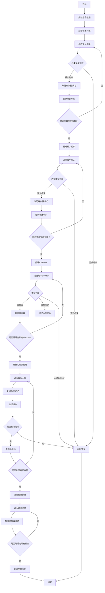

嗯，我需要为这个名为`airAsm`的Zig函数画一个流程图。首先，我得理解这个函数的结构和逻辑。看起来这个函数处理内联汇编指令，生成机器码。

函数开始处定义了一些变量，比如`pt`、`zcu`，然后从`self.air`中提取数据。接下来处理输出和输入的操作数，初始化一些列表和映射。然后遍历输出和输入，处理约束条件，分配寄存器或内存，处理可能的错误。

之后处理clobbers（被破坏的寄存器），接着解析汇编源代码，处理标签和指令。最后处理结果，存储到对应的位置，并处理生命周期管理。

我需要把这些步骤分解成流程图中的各个节点。首先，开始节点是函数入口。然后，提取指令数据、处理输出操作数、处理输入操作数、处理clobbers、解析汇编行、生成机器指令、处理结果存储，最后结束。

需要注意的是错误处理的分支，比如遇到无效约束条件时返回错误。此外，循环处理每个输出、输入和汇编行也需要在流程图中体现。

可能的结构是：

1. 开始
2. 提取指令数据
3. 处理输出约束
   - 遍历每个输出
   - 分配寄存器或内存
   - 错误处理
4. 处理输入约束
   - 遍历每个输入
   - 分配寄存器或内存
   - 错误处理
5. 处理clobbers
6. 解析汇编行
   - 遍历每行
   - 处理标签
   - 生成指令
   - 错误处理
7. 处理结果存储
8. 处理生命周期和结束

每个步骤中的条件判断和循环需要用菱形框表示，比如遍历输出、输入时是否还有下一个元素，处理约束时是否有效等。

可能还需要考虑一些子流程，比如处理输出时的不同约束类型（寄存器、内存、立即数等），以及生成指令时的不同情况（前缀、操作数类型等）。

最后，确保所有可能的路径都被覆盖，包括正常流程和错误返回。
================================================

流程说明：
1. 函数入口初始化并提取指令元数据
2. 分两个阶段处理约束（输出->输入），包含寄存器分配和错误检测
3. 处理clobbers段，处理寄存器锁定和特殊标记
4. 逐行解析汇编源码，处理标签和指令生成
5. 结果回写阶段将寄存器内容写回内存
6. 生命周期管理和资源释放
7. 错误处理贯穿整个流程，任何阶段发现错误立即终止流程
8. 最终完成AIR指令生成并返回结果