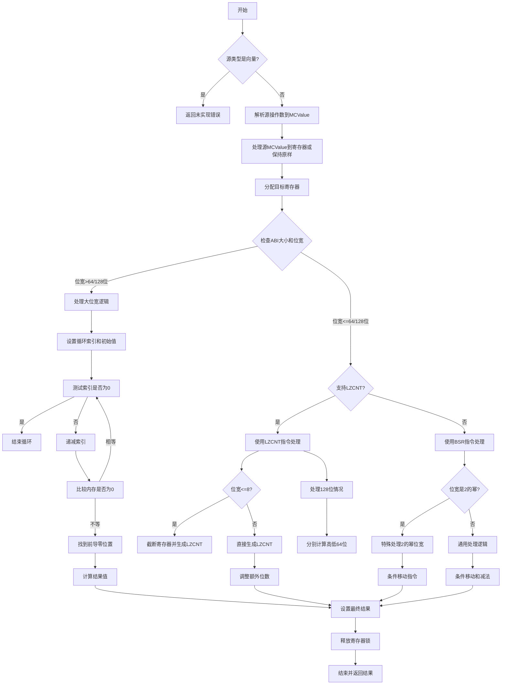

好的，我需要为给定的Zig函数`airClz`绘制流程图。首先，我需要理解这个函数的结构和逻辑。这个函数处理的是计算前导零的数量（Count Leading Zeros）。看起来它处理不同的情况，比如向量类型、不同的位宽（如8位、64位、128位），以及是否支持LZCNT指令。

首先，函数开始处理参数，确定源类型和目标类型。然后检查源类型是否是向量，如果是则返回未实现错误。接下来，处理源操作数的MCValue，可能需要将其加载到寄存器中。然后根据不同的位宽和CPU特性（如是否支持LZCNT）生成不同的汇编指令。

我需要将整个函数的逻辑分解成主要的步骤和分支。例如：

1. 检查是否为向量类型，如果是，报错。
2. 处理源操作数，可能复制到临时寄存器。
3. 根据位宽是否超过64或128位，分情况处理。
4. 如果支持LZCNT指令，处理不同位宽的情况（8位、64位、128位）。
5. 如果不支持LZCNT，使用BSR指令并处理不同的分支。

需要注意条件判断和循环结构，比如在处理大位宽时使用的循环结构。此外，还需要考虑寄存器分配和释放，以及不同的汇编指令生成路径。

可能的分支点包括：
- 源类型是否为向量
- 位宽是否超过64/128位
- 是否支持LZCNT
- 位宽是否为2的幂次

每个分支下有不同的处理逻辑，需要分别画出对应的流程。同时，需要注意错误处理和资源管理（如寄存器锁定和解锁）。

现在，我需要将这些逻辑步骤转化为Mermaid流程图，使用合适的节点和条件分支，确保流程清晰正确。
================================================

该流程图的关键节点说明：
1. **大位宽处理**：通过循环遍历内存块查找首个非零值
2. **LZCNT路径**：根据位宽选择不同优化方式，包含128位分高低位处理
3. **BSR路径**：处理不支持LZCNT的情况，包含2的幂特例和通用情况
4. **寄存器管理**：贯穿始终的寄存器分配/释放逻辑
5. **结果计算**：最终通过算术运算得出前导零数量