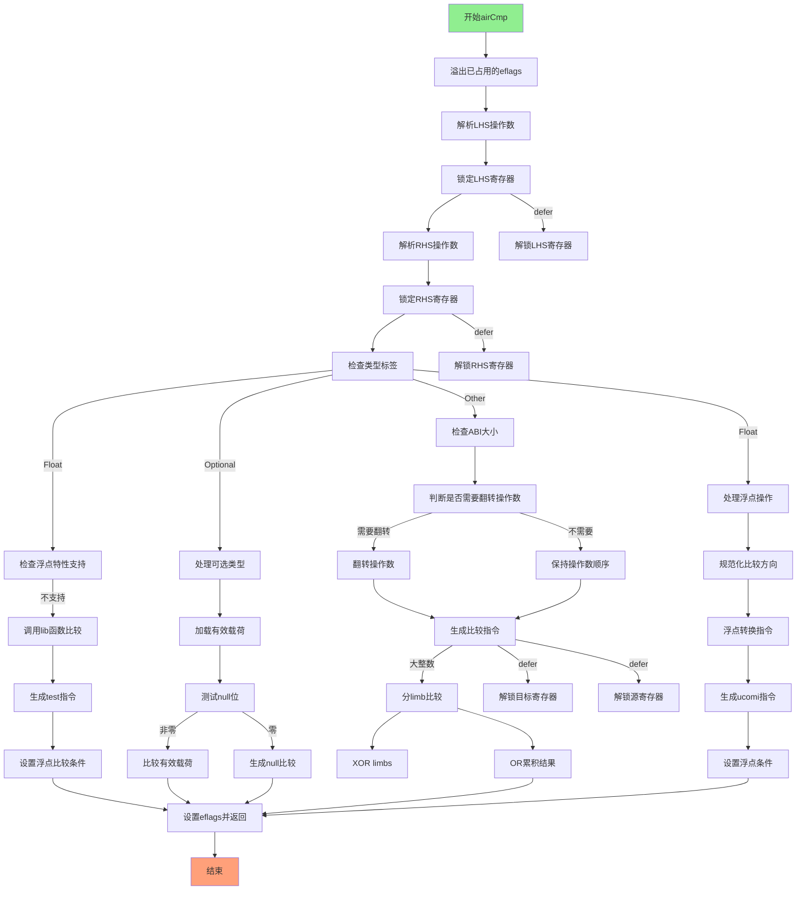

好的，我需要帮助用户将提供的Zig函数`airCmp`转换为Mermaid流程图。首先，我需要仔细阅读并理解这个函数的逻辑结构。

首先，函数`airCmp`处理比较操作，根据不同的类型（如浮点数、可选类型等）生成相应的机器码。函数开始时，获取了指令的操作数类型，并处理了寄存器的锁定和解锁。接着，根据不同的类型标签（如`.float`、`.optional`）进入不同的处理分支。对于浮点数，检查硬件支持的特性，可能需要调用库函数；对于可选类型，处理其有效负载和null值的比较。此外，还有处理整数和其他类型的逻辑，包括生成比较指令和条件跳转。

接下来，我需要将这些逻辑步骤分解成流程图中的各个节点。流程图通常包括开始、结束、判断节点和处理步骤。需要注意各个条件分支，比如类型检查、是否支持特定硬件特性、是否翻转操作数等。同时，需要处理寄存器的分配和释放，以及生成相应的机器指令。

需要特别注意函数中的几个主要分支：
1. 浮点数的处理，包括调用库函数或生成浮点比较指令。
2. 可选类型的处理，包括比较有效负载和null值。
3. 其他类型（如整数）的处理，包括处理不同大小的操作数和可能的操作数翻转。
4. 最终设置标志位并返回结果。

在绘制流程图时，每个条件判断（如`switch (ty.zigTypeTag(zcu))`）应作为菱形判断节点，不同的分支流向不同的处理步骤。处理步骤如寄存器分配、生成指令等应作为矩形节点。此外，需要注意循环结构，例如在处理大整数时可能分解为多个limb进行比较。

可能遇到的挑战是如何将复杂的逻辑结构简化为清晰的流程图，特别是存在多个嵌套的条件和循环的情况下。需要确保每个分支都正确表示，并且流程图的走向符合代码的实际执行路径。

总结步骤：
1. 确定函数的主要流程入口。
2. 分解各个条件分支和处理步骤。
3. 将每个条件判断转化为判断节点。
4. 将处理步骤转化为操作节点。
5. 连接各节点，确保逻辑正确。
6. 使用Mermaid语法绘制流程图。
================================================
