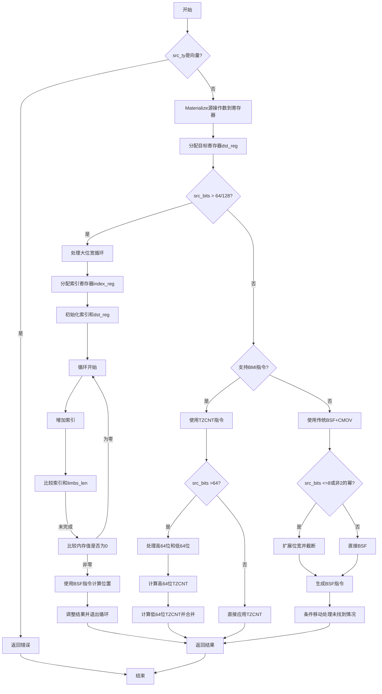

嗯，我需要为这个Zig函数`airCtz`绘制一个流程图。首先，我得理解这个函数的功能和结构。看起来这是一个处理计数尾随零（count trailing zeros）的代码生成函数，用于x86_64架构。函数内部有很多条件分支和不同的处理路径，比如处理向量类型、使用BMI指令集、处理不同位数的操作数等。

首先，我应该通读代码，识别主要的步骤和条件判断。比如，函数开始检查源类型是否为向量，如果是则返回错误。然后处理不同的源操作数类型，可能生成不同的机器码。接着，根据是否有BMI特性，选择不同的指令生成路径。对于较大的位宽（超过64位或128位），可能有循环处理部分。

接下来，我需要将这些步骤分解成流程图中的各个节点。可能的节点包括：开始、检查源类型是否为向量、处理源操作数的materialization、分配目标寄存器、根据位宽选择处理路径、处理大位宽的循环、使用BMI指令的情况、处理不同位宽的寄存器操作、以及最终的返回结果等。

需要注意的是条件分支，比如`if (src_bits > ...)`，`if (has_bmi)`，以及循环结构中的跳转。每个条件判断都应该在流程图中有一个决策节点，分出不同的分支。

另外，代码中有多个临时寄存器的分配和释放，这些可能在流程图中表示为操作步骤，但可能不需要每个细节都画出来，保持流程图简洁。重点应放在主要的逻辑分支和处理路径上。

可能的结构是：

1. 函数开始
2. 检查源类型是否是向量，如果是，返回错误
3. Materialize源操作数到寄存器（如果需要）
4. 分配目标寄存器
5. 判断源位宽是否超过某个阈值（如64或128）
6. 如果是大位宽，进入循环处理流程
7. 否则，检查是否支持BMI指令
8. 根据BMI支持选择不同的指令生成方式
9. 处理不同位宽的情况（如8位、非2的幂次方位宽等）
10. 生成相应的汇编指令
11. 返回结果

在处理大位宽时，可能需要处理多个limb（比如128位拆分为两个64位部分），并在循环中逐个检查，直到找到非零的limb，然后计算尾随零的数量。

对于流程图中的循环结构，需要正确表示循环的开始、条件和结束。例如，在循环中比较索引和limbs长度，如果未完成则继续循环，否则跳出。

此外，代码中有多处寄存器分配和释放，以及条件锁定，这些可能在流程图中作为步骤出现，但可能需要简化以避免过于复杂。

需要确保流程图的每个分支都有明确的路径，并且决策节点清晰。可能使用不同的颜色或形状来表示开始/结束节点、操作步骤、条件判断等。

最后，整合所有步骤，确保逻辑正确，没有遗漏重要的分支或处理路径。
================================================

该流程图按以下逻辑组织：
1. 入口判断向量类型支持
2. 根据位宽大小分叉处理逻辑
3. 大位宽采用循环逐块检测
4. 支持BMI时使用专用指令
5. 传统方法处理时考虑位宽特性和扩展需求
6. 最终统一返回结果路径
7. 使用菱形节点表示条件判断，矩形节点表示操作步骤