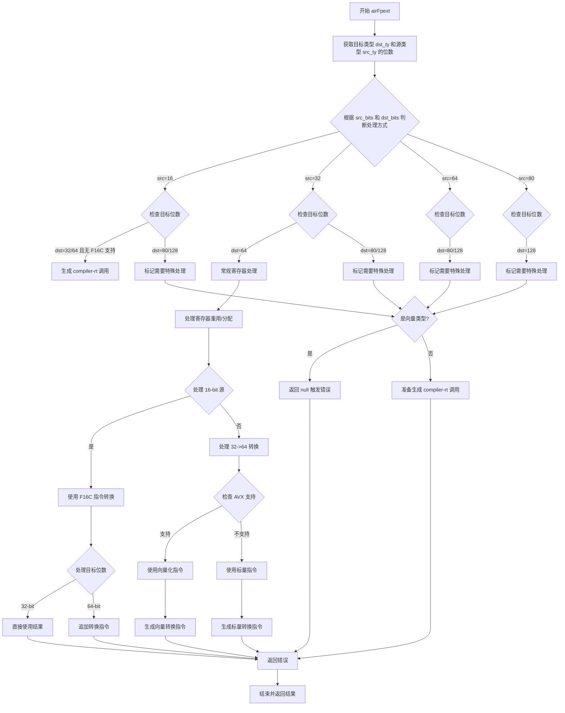

好的，我需要为提供的Zig函数`airFpext`绘制一个流程图。首先，我得仔细理解这个函数的结构和逻辑。

函数`airFpext`处理浮点扩展操作。首先，它会获取目标类型和源类型的位数，然后根据不同的位数组合决定如何生成机器码。主要分为几个部分：

1. **条件判断**：根据源和目标浮点数的位数，判断是否需要调用编译器运行时函数（compiler-rt）或者使用特定的汇编指令。
2. **处理不同情况**：
   - 当源是16位浮点数时，检查是否支持F16C指令集，生成相应的汇编指令。
   - 当源是32位或64位浮点数时，根据目标位数和向量长度生成不同的转换指令。
   - 如果无法处理，则返回错误提示需要实现该情况。
3. **寄存器管理**：包括寄存器的分配、重用和释放。

接下来，我需要将这些逻辑步骤转化为流程图。流程图的开始是函数的入口，然后是各种条件分支，最后是处理不同情况的节点和结束节点。需要注意的是，函数中有多个条件判断，如`switch (src_bits)`和嵌套的`switch (dst_bits)`，需要准确反映这些分支。

可能遇到的挑战是正确表示嵌套的条件判断和循环结构，以及确保所有可能的路径都被覆盖。例如，当`src_bits`为16时，需要进一步判断`dst_bits`是否为32、64等，并根据是否支持F16C来决定路径。此外，存在多个`break :result`语句，这会影响流程图的走向。

需要确认每个条件分支的出口，特别是当某些情况无法处理时，会跳转到生成错误消息或返回结果。另外，函数末尾的`return self.finishAir`是最终的出口点。

在绘制流程图时，使用不同的形状表示不同的操作：矩形表示处理步骤，菱形表示条件判断，平行四边形表示输入/输出，圆形可能用于连接点。确保逻辑清晰，分支正确，没有遗漏任何可能的路径。

最后，验证流程图是否准确反映了代码的结构，特别是条件判断的顺序和嵌套，以及各个分支的处理方式是否正确。
================================================

该流程图展示了：
1. 初始类型解析阶段
2. 多层次条件判断结构（包含 4 级嵌套 switch）
3. 两种主要处理路径（compiler-rt 调用 vs 直接指令生成）
4. 向量/标量指令的分支处理
5. 寄存器重用和分配逻辑
6. 最终结果返回和错误处理机制

特殊形状说明：
- 菱形：条件判断
- 矩形：具体操作步骤
- 圆角矩形：流程起止点
- 虚线框：组合操作组