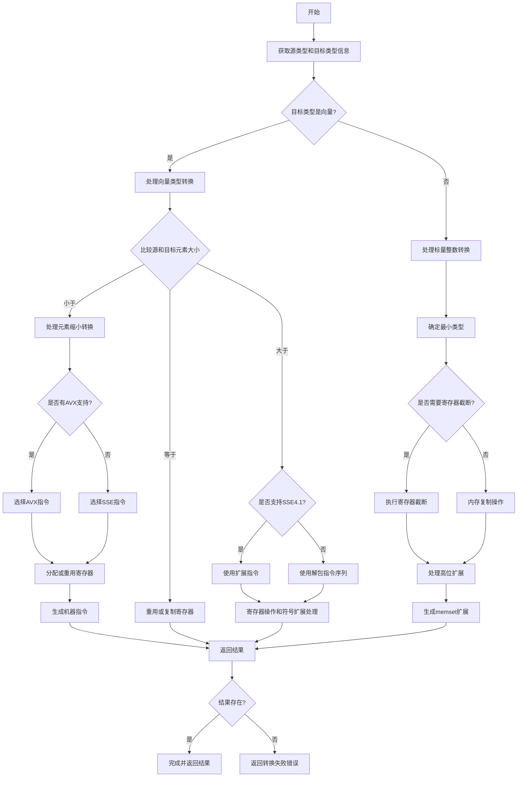

嗯，我需要为提供的Zig函数`airIntCast`绘制一个流程图。首先，我得理解这个函数的结构和逻辑。这个函数看起来是处理整数类型转换的，可能涉及不同位数的整数以及向量类型的处理。函数内部有很多条件判断和分支，比如处理向量类型的情况、不同大小的元素处理、寄存器的分配和重用，以及不同指令集的支持（比如AVX和SSE4.1）。

首先，我需要把整个函数的流程分解成主要步骤。函数开始于获取源类型和目标类型的信息，然后根据不同的情况进行处理。比如，当目标类型是向量时，会进入向量处理的逻辑，否则处理普通的整数转换。在向量处理中，又根据源和目标元素的大小关系分为小于、等于、大于三种情况，每种情况下有不同的指令选择和寄存器操作。对于普通整数转换，处理截断和扩展，包括有符号和无符号的情况。

接下来，我需要确定各个条件分支之间的流程。例如，当目标类型是向量时，函数会检查元素的大小关系，然后根据不同的比较结果进入不同的处理分支。每个分支内部可能有进一步的判断，比如是否有AVX支持，是否需要重用寄存器，或者是否需要生成特定的机器指令。

需要注意函数中的`break :result`语句，这些是用于跳出当前块并返回结果的。这表示在某些条件下，流程会提前结束并返回结果，否则继续执行后续的代码。例如，在处理向量元素大小时，如果某些条件不满足（比如指令不支持），则会提前返回`null`，导致函数进入失败处理。

此外，函数中还有寄存器的分配和管理，比如`register_manager.allocReg`和`copyToRegisterWithInstTracking`，这些操作可能会影响流程的分支，比如是否能够重用已有的寄存器，或者是否需要分配新的寄存器。

最后，函数结束时，如果有结果则返回，否则返回错误信息。需要确保所有可能的路径都被覆盖，包括错误处理路径。

总结一下，流程图的大致结构应该是：

1. 开始：获取源类型和目标类型的信息。
2. 判断目标类型是否是向量：
   - 是：处理向量转换，根据元素大小分为三种情况（lt, eq, gt）。
   - 否：处理普通整数转换，包括截断和扩展。
3. 在各个子分支中处理具体的指令选择、寄存器操作和复制。
4. 处理完所有情况后，返回结果或错误。

需要注意各个条件判断之间的连接，以及可能的提前返回情况。同时，需要正确表示循环和重复操作，但在这个函数中似乎没有显式的循环，主要是条件分支。

可能需要使用不同的节点表示条件判断、操作步骤、寄存器分配、指令生成等。例如，菱形表示条件判断，矩形表示操作步骤，箭头表示流程走向。

在绘制时，要确保每个分支都正确连接，尤其是当存在嵌套条件时。例如，处理向量元素大小的小于情况时，内部还有关于AVX支持的判断，需要进一步细分分支。

另外，错误处理的部分（如返回`self.fail`）也需要在流程图中体现，通常作为终止节点。

可能遇到的挑战是如何简洁地表示复杂的条件嵌套，同时保持流程图的可读性。可能需要将某些复杂的子流程拆分为子图，或者使用注释节点说明关键判断点。

最后，需要验证流程图的正确性，确保所有代码路径都被正确映射，没有遗漏重要的步骤或条件。
================================================
