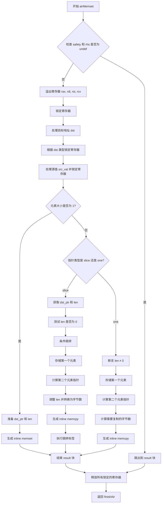

嗯，我需要为这个Zig函数`airMemset`画一个流程图。首先，我得理解这个函数的结构和逻辑。看起来这个函数处理内存设置操作，可能涉及到寄存器管理、内存复制和安全性检查。

首先，函数开始处有一个`result`块，可能用于处理不同情况下的结果。然后检查`safety`是否为假，并且`bin_op.rhs`是否为`undef`，如果是的话，直接跳出到`result`块。这部分可能需要一个条件判断节点。

接下来，函数调用`spillRegisters`来保存一些寄存器，然后锁定这些寄存器。这里可能需要一个步骤表示寄存器的锁定和解锁操作。然后处理目标地址`dst`，根据不同的类型（寄存器、寄存器对等）进行不同的处理，并锁定相应的寄存器。这部分可能需要多个分支。

然后处理源值`src_val`，同样根据类型锁定寄存器。之后根据`elem_abi_size`是否为1，分为不同的处理路径。如果`elem_abi_size`等于1，调用`genInlineMemset`，否则继续处理更大的元素大小。

在`elem_abi_size`不等于1的情况下，分两种情况处理：`slice`指针和`one`指针。对于`slice`，处理指针和长度，生成相应的汇编指令，处理长度是否为0的情况，可能涉及条件跳转。对于`one`指针，处理数组长度，存储第一个元素，然后进行内存拷贝。

整个过程有很多条件分支和循环，比如处理不同的指针类型、寄存器锁定和解锁、条件跳转等。我需要将这些步骤分解成不同的节点，并用箭头连接起来，表示流程的方向。同时，注意错误处理和资源释放，比如`defer`语句中的解锁操作，可能需要放在流程图的适当位置。

可能还需要考虑异常情况的处理，比如`unreachable`的分支，这在流程图中可能需要特殊标记。最后，函数返回`finishAir`，结束当前指令的处理。

总结一下，流程图应该包括以下主要部分：
1. 初始检查和寄存器溢出。
2. 处理目标地址和源值，锁定寄存器。
3. 根据元素大小分叉处理。
4. 处理slice和单指针的不同情况。
5. 生成内存操作指令（memset/memcpy）。
6. 资源释放和返回。

需要确保每个条件判断都有对应的分支，并且步骤之间的顺序正确。可能还需要处理循环结构，比如在slice处理中计算长度和拷贝内存的部分。
================================================

流程说明：
1. 初始检查安全性和未定义值，快速退出分支
2. 寄存器管理阶段包含溢出和锁定操作
3. 核心逻辑分为元素大小为1的快速路径和通用处理路径
4. 通用路径根据指针类型（slice/array）采用不同内存操作策略
5. 包含条件跳转优化和循环展开处理
6. 最终统一释放资源并返回结果
7. 所有路径最终汇聚到寄存器释放和结束环节