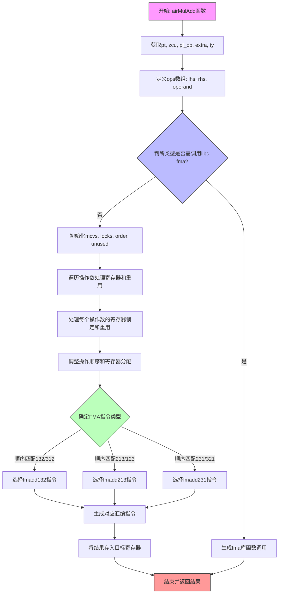

嗯，我需要为这个Zig函数`airMulAdd`绘制一个流程图。首先，我得仔细阅读代码，理解它的逻辑结构。这个函数看起来是处理乘法加法的代码生成部分，可能涉及到浮点运算和FMA（融合乘加）指令的选择。

首先，函数开始部分获取了一些上下文信息，比如`pt`、`zcu`、`pl_op`、`extra`和`ty`。然后定义了`ops`数组，包含三个操作数。接下来有一个大的条件判断，根据类型的不同决定是调用库函数`fma`还是生成机器指令。

在条件判断中，如果类型是16、80、128位浮点，或者32、64位但目标平台不支持FMA，则调用`genCall`生成`fma`函数调用。否则，进入处理FMA指令的逻辑。

在处理FMA指令的部分，代码初始化了一些变量，如`mcvs`、`locks`、`order`和`unused`。然后遍历三个操作数，处理寄存器锁定和重用操作数的情况。接着根据操作数的顺序和类型选择合适的机器指令（如`fmadd132`、`fmadd213`、`fmadd231`），最后生成相应的汇编指令。

流程图中需要涵盖这些主要步骤：初始参数获取、条件判断选择路径、调用库函数或生成机器指令的不同分支、寄存器管理和指令选择的具体步骤。需要注意条件分支、循环处理操作数的部分，以及最终的汇编指令生成。

可能还需要考虑错误处理，比如`try`表达式和`fail`的返回路径。另外，流程图中应体现各个变量和数据结构的变化，比如`mcvs`、`order`的更新过程。

需要将复杂的条件判断和循环结构用流程图清晰地表示出来，可能需要使用多个判断节点和分支路径。同时，确保每个主要操作（如`copyToTmpRegister`、`asmRegisterRegisterRegister`等）都有对应的流程节点。

最后，整合所有步骤，形成完整的流程图，确保逻辑连贯，分支清晰。
================================================
