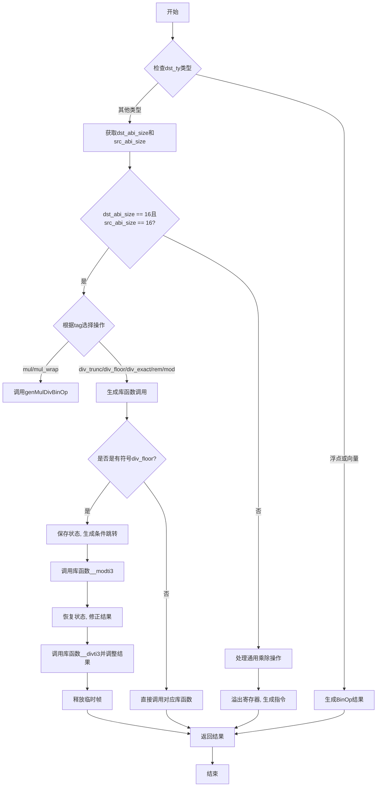

嗯，我现在需要画这个函数的流程图。这个函数是处理乘法和除法操作的，看起来有点复杂。首先，我得仔细读一遍代码，理解它的结构。

函数开头有一些类型检查和分支处理。当目标类型是浮点数或向量时，直接生成二元操作。如果是其他类型，比如整数，就会处理不同情况，比如16字节大小的操作，这时候可能调用一些库函数，比如__udivti3或者其他类似的编译器内置函数。

然后，对于有符号整数的除法取模操作，会有额外的处理，比如保存状态、恢复状态，还有一些条件跳转。这部分可能涉及到寄存器的分配和释放，需要处理临时变量和锁定的寄存器。

接下来，对于不同的操作标签（比如div_floor、mod等），有不同的处理逻辑。例如，当标签是div_floor时，需要生成额外的代码来处理负数的地板除法，可能会调用不同的库函数，并进行一些条件判断和修正结果。

然后，在处理完这些特殊情况后，函数会处理通用的乘除操作，可能需要溢出寄存器，保存和恢复状态，最后生成相应的机器码。

整个流程中有很多条件判断和分支，比如根据dst_ty的类型、操作标签的不同，以及是否有符号来决定不同的处理路径。同时，还需要处理寄存器的分配和释放，确保在生成代码时不会出现寄存器冲突。

我需要把这些逻辑步骤分解成流程图中的各个节点，包括条件判断、函数调用、寄存器操作等。可能的结构是：开始 -> 检查类型是否为浮点或向量 -> 是的话生成二元操作；否则继续处理整数情况 -> 检查目标大小是否为16字节 -> 根据不同的操作标签处理不同的库函数调用 -> 处理有符号数的特殊情况 -> 最后处理通用情况，生成乘除操作 -> 结束。

需要注意各个分支之间的连接，特别是条件分支后的不同路径。比如，当dst_abi_size为16且src_abi_size也为16时，根据不同的tag进入不同的处理流程。此外，对于有符号数的div_floor，需要生成额外的代码块，包括保存状态、执行条件跳转、恢复状态等步骤。

可能还需要考虑错误处理，比如try语句可能会抛出错误，但在流程图中可能不需要详细表示，除非有明确的错误处理分支。

总之，我需要将代码中的各个条件判断和操作步骤转化为流程图中的节点和判断框，确保逻辑顺序正确，覆盖所有可能的分支。
================================================
