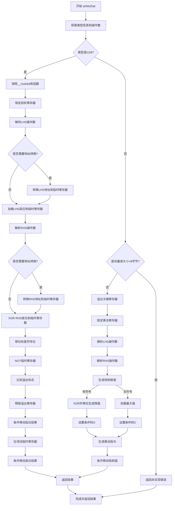

嗯，我现在需要帮用户用Mermaid画出这个Zig函数的流程图。首先，我需要理解这个函数是做什么的。看起来这是一个处理有符号整数乘法溢出的函数，属于代码生成部分，特别是针对x86_64架构的。函数名是airMulSat，可能是指乘法饱和（saturating multiplication）或者处理乘法溢出的情况。

首先，我需要通读代码，理清主要逻辑。函数开始处获取了一些类型信息和操作数，然后分成了两个主要分支：一个是处理i128类型的乘法，另一个是处理其他类型，比如向量或大小超过8字节的类型，但目前这部分还没实现，直接返回错误。对于i128的情况，调用了库函数__muloti4，然后进行了一些寄存器的分配和操作，包括处理溢出标志，最后生成结果。对于其他类型，函数会处理寄存器的溢出，生成乘法指令，并根据是否有符号选择不同的条件码，最后使用cmovcc指令来处理溢出情况。

接下来，我需要将这些逻辑步骤转化为流程图。流程图通常包括开始、结束、判断、处理步骤等。主要的分支有两个：处理i128的情况和处理其他类型的情况。每个分支内部有多个步骤，比如分配寄存器、生成指令、处理溢出等。

需要注意的是，代码中有一些条件判断，比如检查类型是否为i128，是否为向量或大小超过8字节的类型。这些判断会影响流程的走向。此外，每个分支内部还有一些子步骤，比如调用库函数、处理操作数、生成汇编指令等。

可能的步骤分解：

1. 函数开始，获取类型和操作数。
2. 检查是否为i128类型：
   - 是：调用__muloti4，处理寄存器，检查溢出，生成结果。
   - 否：检查是否为向量或大小超过8字节：
       - 是：返回错误。
       - 否：处理寄存器溢出，生成乘法指令，处理条件码，生成结果。
3. 返回结果。

需要将每个判断和处理步骤用流程图节点表示，并用箭头连接。注意循环和条件分支的结构。例如，处理i128的分支中有多个寄存器操作和条件判断，可能需要分解为多个步骤。

另外，代码中的错误处理（如返回TODO错误）也需要在流程图中体现，可能作为单独的分支。

可能需要多次迭代来确保所有步骤都被正确覆盖，并且逻辑结构清晰。同时，要确保流程图的正确性，符合代码的实际执行路径。
================================================
