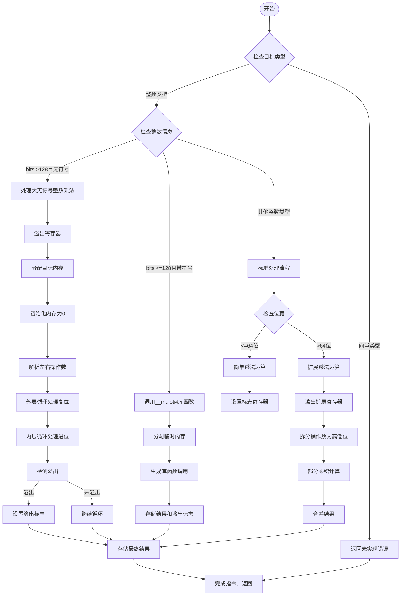

嗯，我需要画这个函数的流程图。首先，这个函数是处理乘法溢出检查的，对吧？看起来代码有点长，我得先理清楚它的结构。

首先，函数开始处理`airMulWithOverflow`，根据不同的类型分支处理。比如，如果是向量类型就直接返回未实现，如果是整数类型则分不同情况处理。这里有很多条件判断，比如判断是否是大于128位的无符号整数，或者是否有符号，不同的位宽处理方式不同。

接下来，代码里有很多寄存器的分配和释放，比如`spillRegisters`和`allocRegs`，这部分可能对应流程中的资源管理步骤。然后生成汇编指令，处理乘法运算，设置条件码，判断是否溢出。

对于大整数乘法，可能分成多个部分处理，比如高位和低位相乘，然后累加进位。这里有很多循环结构，比如外层循环和内层循环，处理不同位数的部分。

还有一部分是调用库函数`__muloti4`来处理128位有符号乘法溢出，这时候需要处理返回值和溢出标志的设置。

最后，根据不同的情况生成结果，设置内存中的结构体字段，返回结果。

可能需要将整个流程分成几个大块：类型判断、寄存器分配、乘法运算处理、溢出检查、结果存储等。每个大块内部再细分不同的条件分支和循环。

不过代码中有很多条件分支，比如根据`dst_info.signedness`选择不同的处理方式，或者根据位数大小选择不同的算法。这些都需要在流程图中体现出来。

另外，需要注意错误处理和未实现的情况，比如`return self.fail(...)`，这可能对应流程中的错误出口。

总之，流程图应该从函数入口开始，根据不同的类型和条件分支，逐步展开各个处理步骤，包括寄存器操作、乘法计算、溢出判断、结果存储，最后返回结果或错误。
================================================

这个流程图展示了：
1. 初始类型检查分支
2. 针对超大无符号整数的循环处理流程
3. 128位带符号整数的库函数调用路径
4. 标准整数处理的分支（简单乘法和扩展乘法）
5. 结果存储和标志设置的公共出口
6. 错误处理路径
关键节点包含寄存器管理、循环处理、溢出检测和不同位宽的特殊处理逻辑。