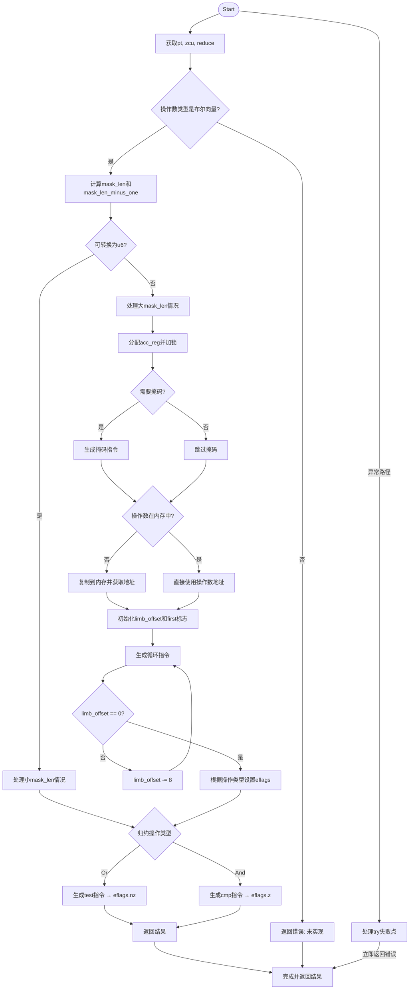

嗯，我需要为这个Zig函数`airReduce`画一个流程图。首先，我得理解这个函数是做什么的。看起来它是处理某种向量归约操作，特别是针对布尔类型的向量。函数里有很多条件判断和不同的处理路径，比如处理不同的归约操作（Or、And等），以及不同的向量长度和掩码情况。

首先，函数开始于获取一些上下文信息，比如`pt`、`zcu`和`reduce`结构。然后进入一个结果块`result: { ... }`，这里有很多条件分支。首先检查操作数的类型是否是布尔向量，如果是，就进行一系列操作，否则返回失败。

在处理布尔向量时，根据向量长度`mask_len`是否有足够的位数，分成两种情况。如果`mask_len - 1`可以转换为u6类型，就执行一些寄存器操作，比如分配寄存器、生成指令，然后根据归约操作类型（Or或And）设置eflags。如果`mask_len`太大，无法转换为u6，就需要分块处理，可能涉及内存操作和循环。

接下来，针对不同的归约操作（Or和And），生成不同的汇编指令，比如test、and、or、mov等，并最终设置eflags的状态作为结果返回。如果遇到不支持的操作，返回错误。

在画流程图的时候，需要将这些条件分支和操作步骤分层次表示出来。可能的结构如下：

1. 开始
2. 获取操作数类型
3. 检查是否是布尔向量
   - 是：处理布尔向量归约
     a. 处理mask_len是否适合u6
       - 是：分配寄存器，生成指令，设置eflags
       - 否：分块处理，循环处理每个块，设置eflags
     b. 根据操作类型（Or/And）生成不同指令
   - 否：返回错误
4. 结束，返回结果

需要注意的是，每个条件分支后的具体操作步骤，比如寄存器分配、内存操作、循环处理等，都需要在流程图中体现。同时，错误处理路径也需要标注出来。

可能遇到的困难是如何将复杂的条件嵌套和循环结构清晰地表达在流程图中，特别是当存在多个嵌套的条件和循环时。需要确保每个判断节点都有明确的是/否分支，并且操作步骤按顺序排列。此外，不同情况下的汇编指令生成和寄存器管理也需要适当简化，避免流程图过于复杂。

另外，函数中使用了Zig的错误处理（try），这些错误处理点也需要在流程图中有所体现，比如当某个步骤失败时，直接返回错误。

总结一下，流程图的大致结构应该包括：

- 开始节点
- 检查操作数类型是否为布尔向量
  - 是：进入布尔向量处理流程
    - 检查mask_len-1是否可转换为u6
      - 是：处理小mask_len的情况
      - 否：处理大mask_len的情况，分块循环处理
    - 根据归约操作类型（Or/And）生成相应指令
    - 设置eflags并返回结果
  - 否：返回未实现的错误
- 结束节点

在具体绘制时，可能需要使用不同的形状来表示判断（菱形）、处理步骤（矩形）、子流程（矩形或圆角矩形）以及错误处理（矩形或菱形）。连接线要清晰标注条件分支的方向。
================================================

### 流程图说明：
1. **入口**：从获取上下文信息开始，检查操作数是否为布尔向量。
2. **主分支**：
   - 若为布尔向量，根据`mask_len`分两种情况处理：
     - **小mask_len**：直接生成掩码测试指令。
    3. **大mask_len**：
       - 分配寄存器并处理掩码需求。
       - 根据操作数存储位置（寄存器/内存）决定是否复制到内存。
       - 通过循环逐块处理数据，最终根据操作类型设置`eflags`。
3. **操作类型判断**：根据`Or`或`And`生成对应的测试指令。
4. **错误处理**：所有`try`语句隐含错误路径，直接终止流程。
5. **结束**：统一通过`finishAir`返回结果或错误。

流程图中菱形表示条件判断，矩形为操作步骤，圆角矩形为子流程，虚线框表示隐含的异常处理路径。