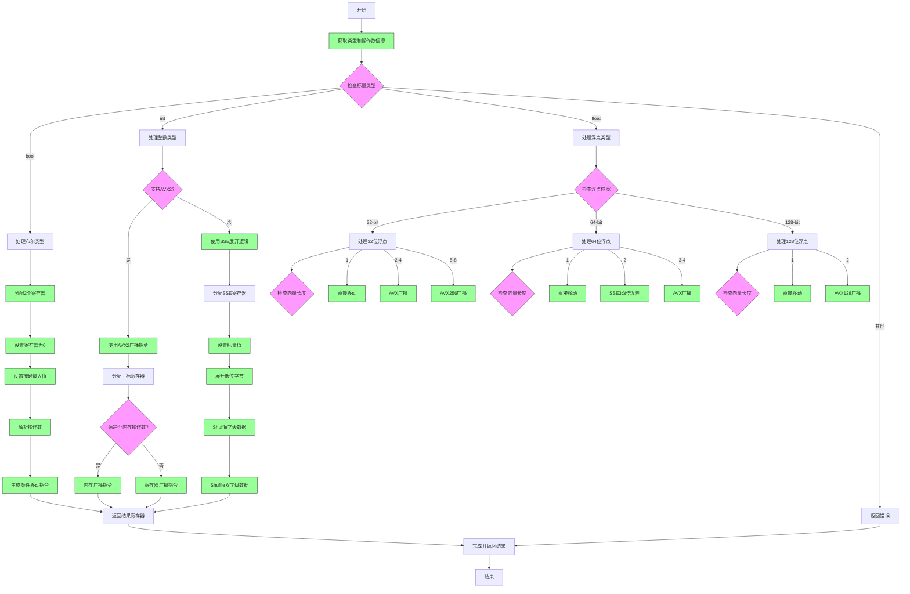

好的，我需要为提供的Zig函数`airSplat`绘制流程图。首先，我会仔细阅读代码，理解其结构和逻辑。

函数`airSplat`处理不同类型的标量值，将它们扩展（splat）到向量中。代码中有多个条件分支，处理不同的类型，如布尔、整数、浮点数，以及不同的向量长度和硬件特性（如AVX、SSE3等）。

首先，函数开始获取一些类型和操作数信息，然后根据标量类型进入不同的处理分支。每个分支内部有更多的条件判断，比如检查向量长度、是否支持特定的CPU特性（如AVX2），并生成相应的机器指令。

接下来，我需要将这一系列的条件判断和处理步骤转化为流程图。可能的步骤包括：

1. 开始：函数入口。
2. 获取类型和操作数信息。
3. 根据标量类型分支：布尔、整数、浮点数等。
4. 每个标量类型分支下，进一步根据向量长度和CPU特性分支。
5. 处理每个子分支，生成对应的机器指令。
6. 如果所有情况都不匹配，返回错误。
7. 结束：返回结果。

需要注意条件之间的嵌套关系，例如在处理整数时，会先检查是否支持AVX2，然后根据不同的位宽和向量长度选择不同的指令。浮点数处理则根据不同的位宽（32、64、128位）和向量长度进一步细分。

需要确保流程图中的每个条件判断和操作步骤都正确表示，并且逻辑清晰。可能需要使用多个判断节点和操作节点，以及合并重复的路径。例如，布尔类型处理中涉及寄存器分配、条件移动指令生成等步骤，这些需要详细展开。

最终，流程图应覆盖所有代码路径，包括错误处理（如`return self.fail`），并且结构清晰，便于理解函数逻辑。
================================================
