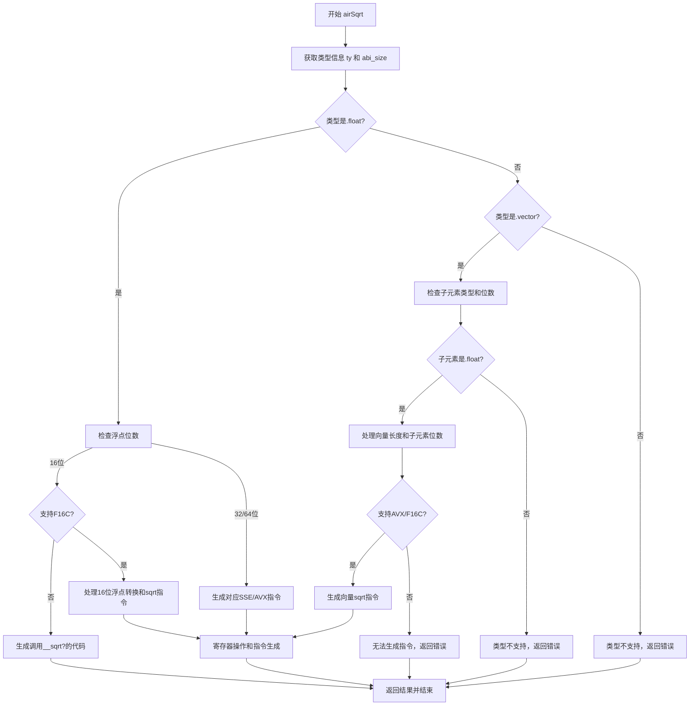

好的，我需要为提供的Zig函数`airSqrt`生成一个Mermaid流程图。首先，我需要理解这个函数的结构和逻辑。

首先，函数`airSqrt`处理平方根指令的生成。它根据不同的类型（如浮点数、向量）和目标平台的特性（如是否支持AVX、F16C等）选择不同的机器指令或调用库函数。

1. **初始步骤**：
   - 获取类型信息`ty`和其ABI大小`abi_size`。
   - 根据`ty`的Zig类型标签进行分支处理，主要是`.float`和`.vector`。

2. **处理浮点类型**：
   - 检查浮点数的位数（16, 32, 64等）。
   - 对于16位浮点，如果没有F16C支持，可能需要调用库函数`__sqrt?`。
   - 对于32和64位浮点，生成对应的SSE或AVX指令（如`sqrtss`, `sqrtsd`）。

3. **处理向量类型**：
   - 检查子元素的类型是否为浮点。
   - 根据子元素的位数和向量长度，选择合适的向量指令（如`vsqrtps`，`vsqrtpd`）。
   - 处理16位浮点向量时，可能需要使用F16C指令进行转换和计算。

4. **寄存器管理**：
   - 重用操作数寄存器或复制到新寄存器。
   - 锁定和解锁寄存器，防止冲突。

5. **生成机器指令**：
   - 根据不同的情况选择`Mir.Inst.FixedTag`。
   - 使用`asmRegisterRegister`、`asmRegisterMemory`等方法生成具体的汇编指令。

6. **返回结果**：
   - 最终将结果存入目标寄存器，完成指令生成。

在绘制流程图时，需要将这些逻辑步骤转化为决策节点、操作节点和流程箭头。可能的节点包括类型检查、特性支持判断、寄存器处理、指令生成等。需要注意条件分支，如不同浮点位数、是否支持AVX/F16C、向量长度等。

需要确保流程图清晰展示函数的主要分支和处理流程，同时不遗漏关键步骤。可能需要使用子流程或分组来组织复杂的条件判断和指令生成步骤。
================================================
