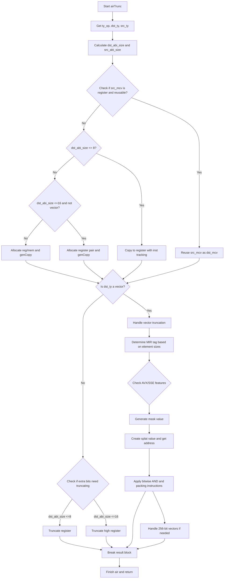

好的，我需要帮用户用Mermaid画出一个Zig函数的流程图。首先，我得仔细看看这个函数的结构和逻辑。

函数是`airTrunc`，属于代码生成部分，处理截断操作。首先，函数开始获取一些类型和操作数信息，比如目标类型dst_ty和源类型src_ty的ABI大小。然后根据不同的条件处理不同的情况。

接下来，处理result块。这里有几个分支：如果源MCV是寄存器且可以重用，就直接使用；否则根据目标大小决定是复制到寄存器还是处理更大的情况，比如寄存器对或分配内存。对于向量类型，有更复杂的处理，包括生成掩码、使用AVX或SSE指令等。最后，处理非向量情况下的截断，可能需要截断高位。

我需要理清各个条件分支，比如dst_abi_size的大小判断、向量类型的处理、不同指令集的支持（如AVX、SSE4.1等）。然后把这些判断和操作步骤转化为流程图的节点和分支。

需要注意，流程图中需要包括开始和结束点，各个条件判断（如是否寄存器重用，目标大小是否<=8，是否是向量类型等），以及对应的操作步骤，如复制到寄存器、分配寄存器对、生成掩码、应用指令等。此外，错误处理和返回结果的部分也要包括进去。

可能的结构是：开始 -> 获取类型信息 -> 处理result块 -> 各条件分支 -> 处理向量或非向量情况 -> 截断处理 -> 结束。每个条件判断用菱形节点，操作用矩形节点，箭头表示流程方向。

需要确保所有分支都被覆盖，特别是错误处理（如fail的情况）和不同的指令集支持路径。可能还需要处理不同寄存器分配的情况，比如分配两个寄存器的情况。

最后，将整个流程整理成Mermaid的语法，注意正确的缩进和节点连接。
================================================
