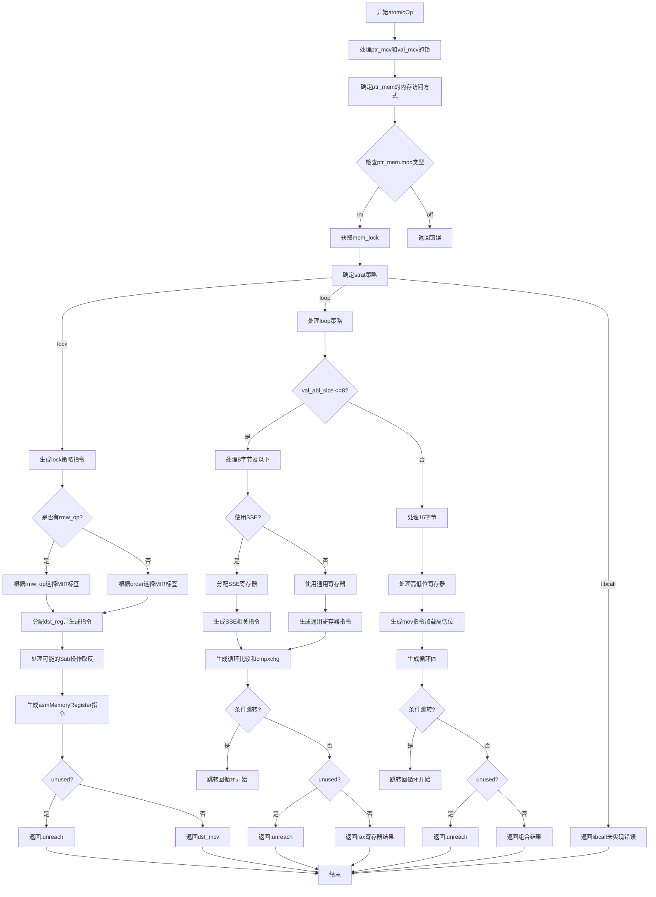

好的，我现在需要为给定的Zig函数`atomicOp`绘制一个流程图。首先，我需要理解这个函数的功能和结构。这个函数似乎处理原子操作，根据不同的条件和参数生成相应的机器码。

首先，我会通读代码，了解大致流程。函数参数包括指针和值的MCValue（可能代表机器码值）、类型信息、是否未使用、RMW操作类型和内存顺序。函数内部有多个锁管理，处理寄存器的分配和释放，然后根据不同的策略（lock、loop、libcall）生成相应的指令。

接下来，我需要确定函数的主要分支。函数开始时处理指针和值的锁，然后根据`ptr_mcv`的类型确定内存访问方式。接着根据`strat`策略选择不同的处理路径：lock、loop或libcall。每个策略下有更细的分支，比如lock策略下根据不同的RMW操作选择不同的MIR标签，而loop策略下处理不同大小的操作数，可能使用SSE寄存器或通用寄存器，处理不同的原子操作如Xchg、Add、Sub等，并生成相应的比较和条件移动指令。对于较大的操作数（如16字节），则分高低位处理。最后，libcall分支暂时未实现，直接返回错误。

在绘制流程图时，应该从函数入口开始，按顺序画出各个步骤和条件判断。需要注意条件分支，如`switch (strat)`分为三个分支，每个分支内部又有多个子分支。例如，在`.lock`策略下，根据不同的`rmw_op`选择不同的MIR指令；在`.loop`策略下，根据操作数大小和是否使用SSE进一步分支，处理不同操作类型，并生成循环结构（如cmpxchg指令和条件跳转）。对于16字节的操作数，还会分高低位分别处理，并可能使用不同的寄存器。

此外，需要注意错误处理，如`self.fail`的调用，这些应该作为流程图的终止节点。同时，寄存器管理和锁的获取与释放也是流程的一部分，但可能不需要在流程图中详细展示，除非对理解流程至关重要。

最后，整合所有步骤，确保逻辑正确，分支清晰。可能需要使用不同的形状表示开始、结束、过程、判断等。例如，开始和结束用椭圆形，过程用矩形，判断用菱形。确保每个分支都有明确的路径，特别是循环部分（如loop标签处的跳转）。

总结流程图的大致结构：

1. 函数开始
2. 处理指针和值的锁
3. 确定内存访问方式（ptr_mem）
4. 确定策略（strat）
5. 根据策略分支：
   a. lock策略：
      i. 确定MIR标签
      ii. 分配寄存器，生成指令
      iii. 返回结果
   b. loop策略：
      i. 处理8字节或更小：
         - 使用SSE或通用寄存器
         - 生成循环（cmpxchg和条件跳转）
      ii. 处理16字节：
         - 分高低位处理
         - 生成循环
      iii. 返回结果
   c. libcall策略：
      i. 返回未实现错误
6. 函数结束

需要确保每个步骤之间的连接正确，特别是循环部分的跳转回到循环开始处。同时，错误情况如`self.fail`应直接指向终止节点。
================================================
