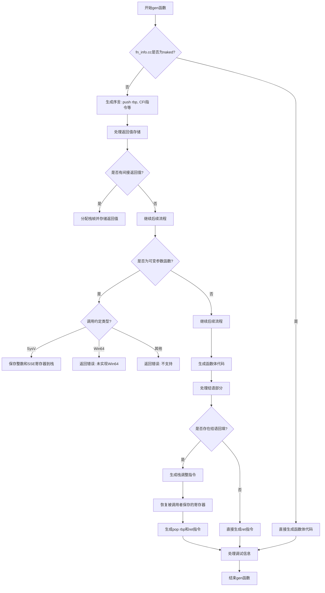

好的，我需要帮助用户将提供的 Zig 代码函数转换为 Mermaid 流程图。首先，我需要理解代码的结构和逻辑流程。让我仔细看一下这段代码。

函数名是 `gen`，属于一个 `CodeGen` 结构体的方法。看起来它负责生成汇编代码。代码一开始检查 `fn_info.cc` 是否不等于 `.naked`，如果不是，则生成一些初始的汇编指令，比如 `push rbp` 和设置 CFI（调用帧信息）。然后处理返回值的存储位置，特别是处理间接返回的情况，将其溢出到栈上。接着处理可变参数函数的情况，针对不同的调用约定（SysV 和 Win64）有不同的处理逻辑。之后生成函数体代码，处理序言和结语部分，调整栈指针，保存和恢复被调用者保存的寄存器，最后处理调试信息。

如果 `fn_info.cc` 是 `.naked`，则直接生成函数体，不处理栈帧和寄存器保存。

接下来需要考虑如何将这一系列条件分支和循环转换为流程图。可能的步骤包括：

1. 开始函数。
2. 检查是否是 naked 函数。
   - 如果不是，处理序言（push rbp，CFI 指令），处理返回值存储，处理可变参数，生成函数体，处理结语（栈调整，恢复寄存器，pop rbp，ret）。
   - 如果是，直接生成函数体并处理调试信息。
3. 在非 naked 分支中，需要处理多个子条件，比如是否有间接返回，是否是可变参数函数，不同的调用约定，栈调整的方式（根据大小选择不同的汇编指令），保存和恢复寄存器列表。
4. 最后处理调试信息的结束标记。

需要注意各个条件分支的位置，比如在处理非 naked 函数时，有多个子条件，比如 `switch (self.ret_mcv.long)`，处理可变参数的 `if (fn_info.is_var_args)`，以及后续的栈调整和寄存器保存恢复。

可能的流程图结构如下：

- 开始
- 检查是否是 naked 函数？
  - 是：
    - 生成函数体
    - 处理调试信息结束
  - 否：
    - 生成序言指令（push, CFI）
    - 处理返回值存储（间接情况）
    - 处理可变参数（SysV/Win64）
    - 生成函数体
    - 处理结语（栈调整，恢复寄存器，pop rbp, ret）
    - 处理调试信息
- 结束

但需要更详细地展开各个子步骤，尤其是条件分支和循环。例如，处理可变参数时，如果是 SysV 调用约定，会保存寄存器到栈；如果是 Win64，则返回错误。栈调整部分根据调整大小选择不同的指令，比如 sub、pseudo_probe_adjust_unrolled_ri_s 或者使用循环调整。

在绘制流程图时，需要使用不同的节点表示条件判断、操作步骤、循环等。例如：

- 菱形节点表示条件判断（如 if、switch）
- 矩形节点表示操作步骤（如生成汇编指令）
- 箭头表示流程走向

需要确保每个条件分支都有明确的出口，比如处理完 SysV 的可变参数后继续后面的步骤，而遇到 Win64 则直接返回错误。此外，处理结语部分时可能需要根据之前保存的寄存器列表生成相应的恢复指令。

另外，代码中的 `backpatch` 部分可能需要循环处理多个占位符，但流程图中可能简化为一个步骤，比如“回填栈调整指令”或“回填寄存器保存/恢复指令”。

最后，处理调试信息的部分在两种情况下都会执行，所以应该在流程图的末尾统一处理。

总结，流程图的大致结构是：

1. 开始
2. 检查函数是否为 naked
   - 是：生成函数体，处理调试信息，结束
   - 否：
      a. 生成序言（push rbp，CFI）
      b. 处理返回值的间接存储
      c. 如果是可变参数函数，处理参数保存（根据调用约定）
      d. 生成函数体
      e. 处理结语（栈调整，恢复寄存器，pop rbp，ret）
      f. 处理调试信息
3. 结束

在每个步骤中，需要展开具体的条件判断和操作，确保所有代码路径都被覆盖。
================================================

该流程图展示了以下关键路径：
1. 根据是否naked函数分支处理
2. 非naked函数处理序言、返回值存储、可变参数处理
3. 可变参数函数根据调用约定进行不同处理
4. 函数体生成和结语处理（包含栈调整和寄存器恢复）
5. 最终统一处理调试信息
6. 两种执行路径最终合并到结束节点