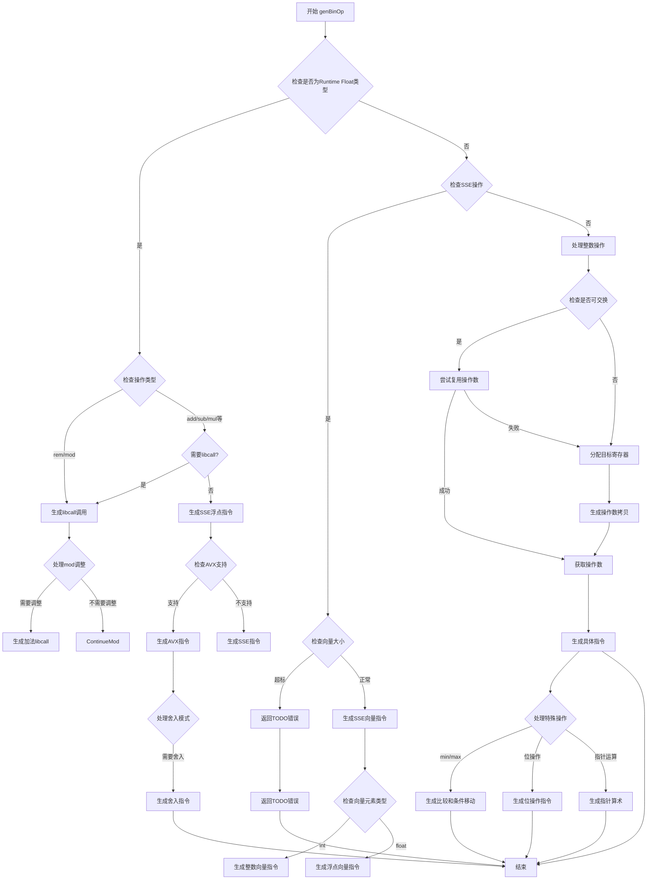

好的，我需要帮助用户用Mermaid画出给定Zig函数的流程图。首先，我需要仔细阅读并理解这个函数的逻辑。这个函数名为genBinOp，看起来像是处理二进制操作的代码生成部分。函数参数包括CodeGen指针、可能的指令索引、操作标签、左右操作数的引用等。

首先，我会尝试理清函数的主要结构。函数开始时检查类型是否为运行时浮点数，如果是，则处理libcall的情况。然后处理不同类型的操作，比如SSE操作、整数操作等。函数中有多个条件分支，处理不同的操作类型（如add、sub、mul等）和不同的数据类型（如float、vector、int等）。

接下来，我需要将这些复杂的条件分支和循环结构转化为流程图。流程图应该从函数入口开始，根据不同的条件分支展示不同的处理路径。例如，处理浮点数时可能需要调用库函数，而处理整数或向量时则使用不同的指令生成逻辑。

需要注意函数中的多个switch语句，这些会根据不同的操作标签（air_tag）和类型标签（如float、vector的子类型）选择不同的处理方式。例如，对于浮点数的加减乘除，可能会生成不同的汇编指令，或者调用不同的库函数。

此外，函数中还有寄存器管理和复制的逻辑，这部分也需要在流程图中有所体现，比如分配寄存器、锁定和解锁寄存器、复制操作数到临时寄存器等。

在处理过程中，可能会遇到一些错误情况，例如不支持的操作类型，这时函数会返回错误信息。这些错误处理路径也需要在流程图中标注出来。

最后，考虑到代码的复杂性，流程图需要分层次展示，先展示主要的分支结构，再深入到各个子处理流程中。例如，先判断是否是浮点操作，如果是则进入libcall处理流程，否则继续处理整数或向量操作，再根据具体操作类型生成相应的指令。

总结来说，我需要将函数分解成几个主要部分：类型检查、库调用处理、SSE操作处理、整数操作处理、寄存器管理、错误处理等，并将这些部分用Mermaid的流程图语法连接起来，确保逻辑清晰，分支明确。
================================================

这个流程图展示了以下关键路径：

1. **类型检查**：首先判断操作数是否为浮点类型，决定是否走libcall路径
2. **LibCall处理**：对于需要调用库函数的操作（如80/128位浮点运算），生成对应的符号调用
3. **SSE/AVX路径**：针对向量和浮点操作，根据CPU特性选择最优指令集
4. **整数操作路径**：处理常规整数运算，包含寄存器复用优化
5. **特殊操作处理**：单独处理min/max/比较等需要条件判断的操作
6. **错误处理**：对未实现的功能返回TODO错误

每个主要判断节点用菱形表示，操作步骤用矩形表示，箭头方向表示程序执行流程。对于复杂的分支（如不同位宽的浮点处理），采用子判断结构进行细化。