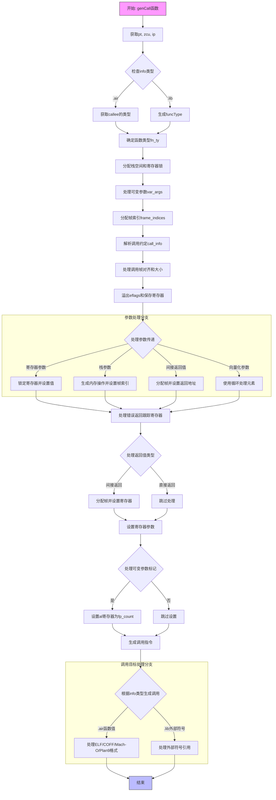

嗯，我需要为给定的Zig函数生成一个流程图。这个函数名为`genCall`，看起来是处理函数调用的代码生成部分。首先，我需要理解这个函数的主要步骤和逻辑流程。

首先，函数参数有`info`，它是一个联合类型，可以是`.air`或`.lib`。接着，根据不同的`info`类型，获取函数类型`fn_ty`。对于`.air`，需要从`callee`的类型中获取函数类型；对于`.lib`，则通过`funcType`生成。

然后，分配一些栈空间和寄存器锁，处理参数传递。这里涉及到处理可变参数`var_args`，分配帧索引`frame_indices`，以及锁定寄存器`reg_locks`。接下来，解析调用约定`resolveCallingConventionValues`，处理调用帧的分配和对齐。

之后，处理寄存器的溢出（spill）操作，保存调用者保存的寄存器。接着，处理参数传递，包括寄存器和栈上的参数设置。这里有很多条件分支，比如根据参数类型设置寄存器或栈位置，处理间接返回值等。

然后，处理错误返回跟踪寄存器`err_ret_trace_reg`，确保其正确设置。接着，处理间接返回值的帧分配，并设置相应的寄存器。

接下来是实际的参数设置，根据不同的调用约定（如x86_64_sysv或x86_64_win）处理寄存器的设置和类型提升。对于可变参数函数，设置`al`寄存器为浮点参数的数量。

最后，根据不同的二进制文件格式（ELF、COFF、Mach-O、Plan9）生成相应的调用指令，处理外部符号引用，或者直接调用函数指针。

整个过程涉及到多个条件分支、循环处理参数、寄存器的分配与锁定，以及不同目标文件格式的处理。需要将这些步骤整理成流程图，使用不同的节点表示条件判断、循环、函数调用等，并用箭头连接各个步骤。

需要确保流程图的每个主要步骤都被正确表示，特别是条件分支部分，如`.air`和`.lib`的处理、不同二进制格式的处理等。同时，注意异常处理和资源释放部分，如`defer`语句释放分配器内存和寄存器锁。
================================================
