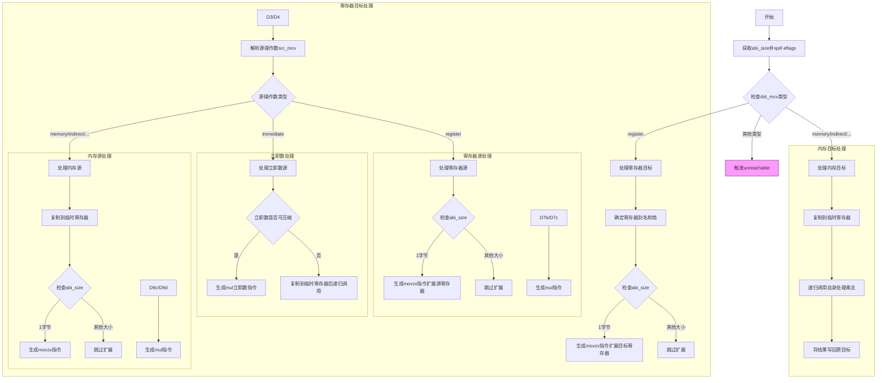

好的，我现在需要帮助用户将给定的Zig函数`genIntMulComplexOpMir`转换为Mermaid流程图。首先，我需要仔细阅读并理解这段代码的功能和结构。

首先，函数`genIntMulComplexOpMir`的参数包括`self`（CodeGen指针）、`dst_ty`（目标类型）、`dst_mcv`（目标MCValue）和`src_mcv`（源MCValue）。函数的主要目的是生成整数乘法操作的机器码。

接下来，我观察函数的结构：

1. 函数开始处获取`pt`和`abi_size`，并尝试溢出eflags。
2. 主要的处理逻辑是基于`dst_mcv`的不同情况进行分支处理。特别是，当`dst_mcv`是寄存器（`.register`）时，处理较为复杂，其他情况则可能触发未实现或无法修改的错误。
3. 在处理`.register`分支时，根据`abi_size`的不同（例如是否为1字节），生成不同的汇编指令，如`movzx`用于零扩展。
4. 然后处理`src_mcv`的不同情况，如寄存器、立即数、内存地址等，分别生成对应的汇编指令或进行临时寄存器的复制。
5. 如果`dst_mcv`是内存或其他间接形式，则使用临时寄存器进行操作，最后将结果复制回原目标。

接下来，我需要将这些逻辑步骤转化为流程图。流程图应涵盖主要的分支结构，例如：

- 开始
- 处理不同的`dst_mcv`情况
  - 如果是寄存器的情况，进一步处理`abi_size`和`src_mcv`
  - 如果是内存或其他间接情况，使用临时寄存器处理并复制回
- 错误处理或未实现的情况

需要注意每个分支中的条件和操作，例如当`abi_size`为1时生成`movzx`指令，或者当立即数过大时复制到临时寄存器再递归调用自身。

可能的挑战在于如何简洁地表示复杂的条件分支，尤其是嵌套的switch语句。需要确保流程图不会过于复杂，同时涵盖所有主要路径。此外，需要正确映射各个case到对应的流程步骤，例如`.register`的处理与其他情况的处理。

最后，根据以上分析，构建Mermaid流程图的结构，使用子图来组织不同的分支情况，并用箭头连接各步骤。
================================================
