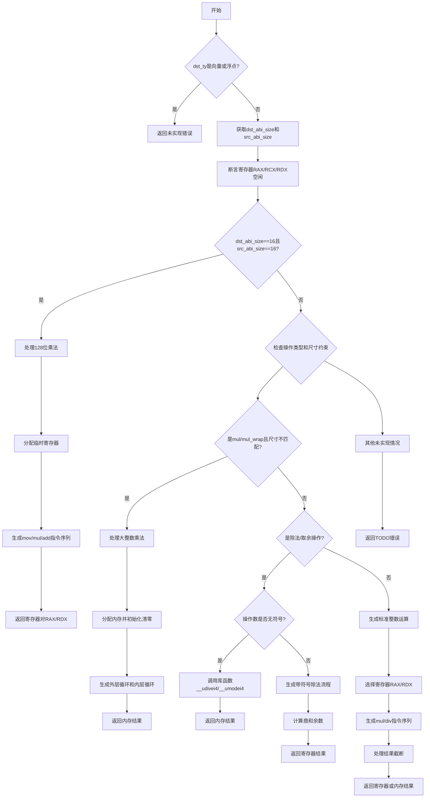

嗯，我需要为这个Zig函数生成一个流程图。首先，我得仔细读一遍代码，理解它的结构。这个函数genMulDivBinOp看起来处理乘法和除法操作，根据不同的tag（比如.mul、.div_trunc等）生成不同的机器码。

首先，函数开始时检查dst_ty是否是向量或浮点类型，如果是的话，就直接返回一个未实现的错误。接下来，它获取目标类型和源类型的ABI大小，并断言一些寄存器是空闲的。然后根据dst_abi_size和src_abi_size是否为16的情况进行处理，这里可能处理的是128位的乘法。

接下来，如果目标ABI大小是16且源大小也是16，处理mul或mul_wrap的情况，这里涉及到一些寄存器的分配和操作，比如mov、mul、add等指令。然后返回寄存器对.rax和.rdx。

如果dst_abi_size不等于src_abi_size，或者src_abi_size大于8，可能需要处理更复杂的情况，比如调用库函数进行大整数运算，或者生成内联的循环来进行乘法或除法。这里有很多分支，比如处理有符号和无符号的情况，不同的操作类型（div_trunc、rem等）。

然后，对于一般的整数乘除运算，根据不同的tag生成对应的汇编指令，比如使用mul或div指令，处理有符号和无符号的情况，最后将结果存储在合适的寄存器或内存位置。

需要注意的是，函数中有很多条件判断，比如switch语句根据不同的tag进入不同的处理分支，同时还需要处理寄存器的锁定和释放，避免冲突。

为了画流程图，我需要将主要的判断和分支路径理清楚。大概的流程可以分为以下几个步骤：

1. 检查目标类型是否为向量或浮点，如果是则返回错误。
2. 获取目标类型和源类型的ABI大小。
3. 检查并确保相关寄存器可用。
4. 处理128位乘法的情况（dst_abi_size和src_abi_size都为16）。
5. 处理其他乘法、除法、取余等情况，根据不同的tag和符号性（有符号/无符号）进入不同的处理逻辑。
6. 对于复杂情况，可能需要调用库函数或生成内联循环。
7. 最后处理结果，将结果存储在合适的MCValue中返回。

在流程图中，每个条件判断（如if、switch case）都会产生分支，每个分支处理不同的情况，可能需要不同的寄存器和指令操作。同时需要注意错误处理和未实现的情况。

可能会有一些循环结构，比如在处理大整数乘法时使用的内联循环，这时候流程图中需要表示循环的开始和结束。

现在，我需要把这些步骤转化为mermaid的流程图语法，确保每个判断和分支都正确表示，同时保持流程图的清晰和可读性。
================================================

流程图说明：
1. 从类型检查开始，排除未实现的向量/浮点类型
2. 处理特殊128位乘法场景（使用RAX/RDX寄存器对）
3. 对常规整数运算分三种主要路径：
   - 大整数乘法（多精度算法循环）
   - 除法/取余操作（区分有符号/无符号）
   - 标准整数运算（直接使用mul/div指令）
4. 每个分支最终都会返回MCValue结果（寄存器/内存/错误）
5. 包含错误处理路径和未实现功能的返回
6. 寄存器管理贯穿整个流程（锁/解锁机制未在图中显式展示）