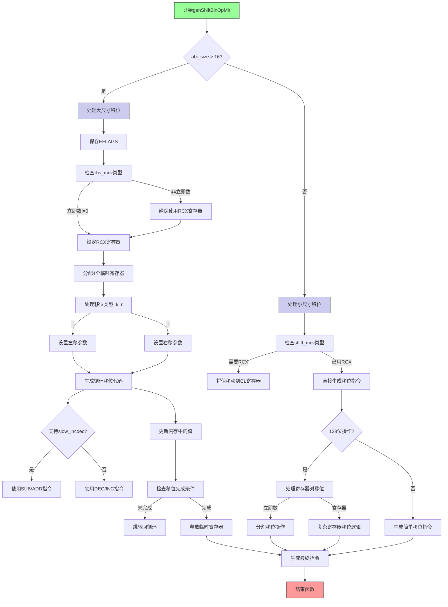

嗯，用户让我用Mermaid画出一个Zig函数的流程图。首先，我需要理解这个函数的功能。函数名是genShiftBinOpMir，看起来是生成二进制移位操作的机器码。这个函数处理不同的情况，比如不同的移位方向（左移或右移）、不同的操作数类型（立即数、寄存器、内存地址等），以及不同大小的数据类型。

首先，我需要通读代码，理清逻辑结构。函数开始时检查abi_size是否大于16，如果是，处理大尺寸的移位操作，使用多个寄存器进行复杂的循环移位。否则，处理较小的尺寸，可能直接生成对应的移位指令。

接下来，代码中有很多条件分支，比如检查是否是立即数0，是否需要锁定寄存器，处理不同的移位方向（左移_l或右移_r），以及处理不同的内存访问方式。每个分支下都有相应的汇编指令生成。

流程图需要涵盖这些分支，包括主要的条件判断，如abi_size > 16、是否是立即数、是否需要使用rcx寄存器等。然后，根据不同的情况画出处理流程，比如分配临时寄存器、生成循环移位代码、处理立即数移位和寄存器移位等。

需要注意的是，函数中有多个嵌套的switch语句和条件判断，这些都需要在流程图中体现出来。此外，处理大尺寸数据时使用的循环结构，以及处理不同移位方向时的不同逻辑，都是关键点。

可能的结构是：开始 -> 检查abi_size > 16 -> 是：处理大尺寸移位（分配寄存器，循环移位逻辑）；否：处理小尺寸移位（检查移位类型，生成对应指令）。每个分支下再细分处理立即数、寄存器等情况。

需要确保流程图清晰展示所有主要路径，包括错误处理和返回点。同时，注意代码中的defer语句和寄存器锁定/解锁，这些可能影响流程的结构，但在流程图中可能简化为步骤，如“锁定寄存器”和“解锁寄存器”。

最后，生成Mermaid代码时，使用适当的节点和箭头，用条件判断分支，确保逻辑正确且易于理解。
================================================
