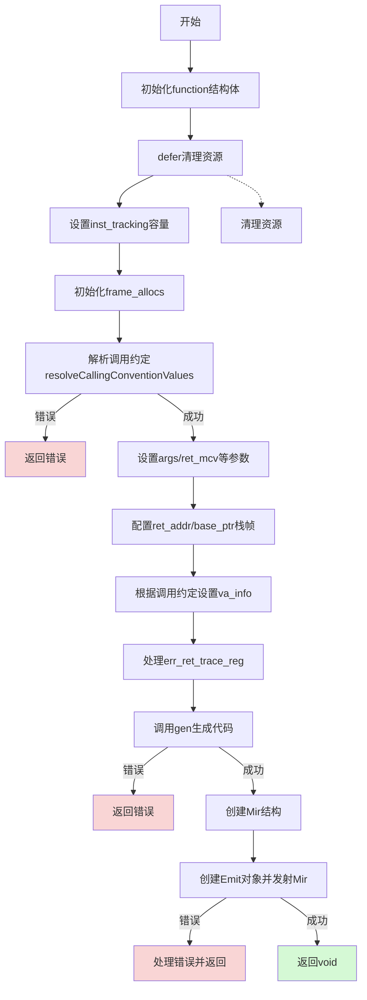

嗯，我现在需要为这个Zig函数生成一个流程图。首先，我得仔细看看这个函数的结构。函数名是generate，看起来是负责生成机器码的。让我先通读一遍代码，理清主要的步骤和逻辑分支。

首先，函数开始部分初始化了一些变量，比如zcu、comp、gpa等。然后创建了一个function结构体，里面包含了很多配置和状态信息。后面跟着一个defer块，释放各种资源，比如frame_allocs、loops、blocks等。这部分可能在流程图中作为结束时的清理步骤。

接下来，有对inst_tracking的容量设置和循环初始化，这里可能是在准备指令跟踪的数据结构。然后是一些日志记录，可能是调试用的。

然后设置frame_allocs的几个索引，像是stack_frame、call_frame，这些可能和栈帧分配有关。之后调用了resolveCallingConventionValues来处理调用约定，获取call_info，这里可能有错误处理，需要分支。

之后，设置args、ret_mcv等变量，并根据调用约定处理参数和返回值的栈帧信息。然后根据不同调用约定（如x86_64_sysv和x86_64_win）设置va_info结构。如果存在错误返回跟踪寄存器，还需要进行相关处理。

然后调用function.gen()生成代码，这里可能有错误处理，比如CodegenFail或OutOfRegisters，这时候需要返回相应的错误。

接下来，创建了一个mir结构，保存生成的指令，然后通过emit对象来发射这些指令。emit部分也有错误处理，比如LowerFail、EmitFail等，需要处理错误信息。

整个函数的流程大致是：初始化配置，准备数据结构，处理调用约定，生成代码，处理错误，发射生成的机器码，最后清理资源。

画流程图的时候，需要按照这个顺序来。每个主要步骤作为一个节点，错误处理作为分支。特别是调用resolveCallingConventionValues和gen()函数时可能出现的错误，需要作为条件判断分支。

可能的结构：

1. 初始化function结构体
2. defer清理资源的准备
3. 设置inst_tracking和frame_allocs
4. 解析调用约定（call_info）
5. 处理参数和返回值的栈帧
6. 设置va_info
7. 生成代码（gen()）
8. 处理gen()的错误
9. 创建mir并发射
10. 处理发射过程中的错误
11. 清理资源（通过defer）

需要注意错误处理的路径，比如当resolveCallingConventionValues或gen()返回错误时，如何跳转到错误处理并返回。

此外，可能有一些条件分支，比如根据fn_info.cc的不同来设置va_info的不同结构，这部分在流程图中可能需要条件判断节点。

最后，流程图的结束部分是函数返回，可能在成功发射代码后返回void，或者在错误时返回相应的错误码。
================================================

流程图说明：
1. 从初始化结构体开始，通过`defer`预置资源清理逻辑
2. 依次完成寄存器跟踪初始化、栈帧分配、调用约定解析
3. 关键错误处理节点用红色标注（resolve/emit错误）
4. 主流程包含条件分支（x86_64_sysv/win64的va_info设置）
5. 最终成功路径用绿色标注，资源清理通过`defer`自动执行
6. Mir发射阶段包含详细的错误类型处理逻辑