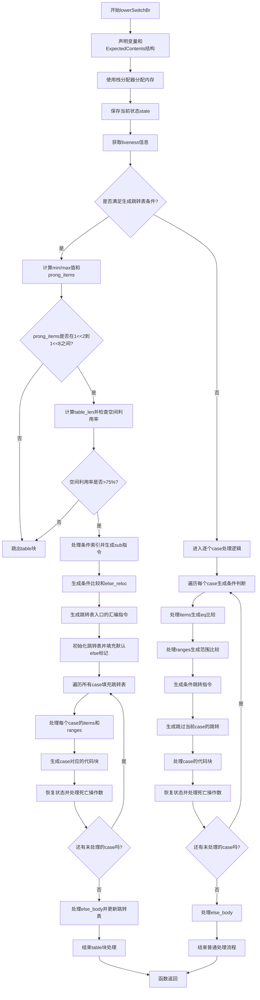

嗯，我需要用Mermaid来画这个函数的流程图。首先，这个函数是lowerSwitchBr，看起来是用来处理switch分支的代码生成。我需要先通读代码，理解它的结构。

函数开始时声明了一些变量，比如zcu、condition_ty、condition_int_info等。然后有一个ExpectedContents的结构体，可能是用来分配内存的。接下来用了一个stackFallbackAllocator，可能是为了临时内存分配。

然后保存了状态state，获取了liveness信息，之后根据条件判断是否进入table块。这里有一个if (!cg.mod.pic and cg.target.ofmt == .elf)的条件，如果不满足的话，可能会跳到后面的代码。

在table块中，处理了各种case，计算min和max值，检查prong_items的数量，如果不符合条件就跳出table块。然后处理条件索引，生成一些汇编指令，构建跳转表。接着处理每个case，填充跳转表，生成对应的代码块，最后处理else部分。

如果不在table块中，就会进入另一个逻辑，遍历每个case，生成条件判断和跳转指令，处理每个case的items和ranges，最后处理else_body。

整个流程大概分为两部分：处理可以生成跳转表的情况，以及逐个处理case的情况。需要根据不同的条件分支来画流程图。

接下来，我需要按照代码的执行流程，将主要步骤转化为Mermaid的节点和判断分支。比如，开始函数，处理条件，进入table块或者普通处理，处理每个case，生成代码块，处理else部分，结束函数。

可能需要注意循环和条件判断的嵌套，比如在处理case的时候可能有多个循环，或者条件分支。需要确保每个分支都有正确的箭头指向，包括条件成立和不成立的情况。

可能还需要处理错误情况，但代码里用了try，所以如果有错误会向上返回，可能不需要在流程图中体现错误处理。

最后，整理这些步骤，用Mermaid语法画出流程图，确保逻辑正确，结构清晰。
================================================
