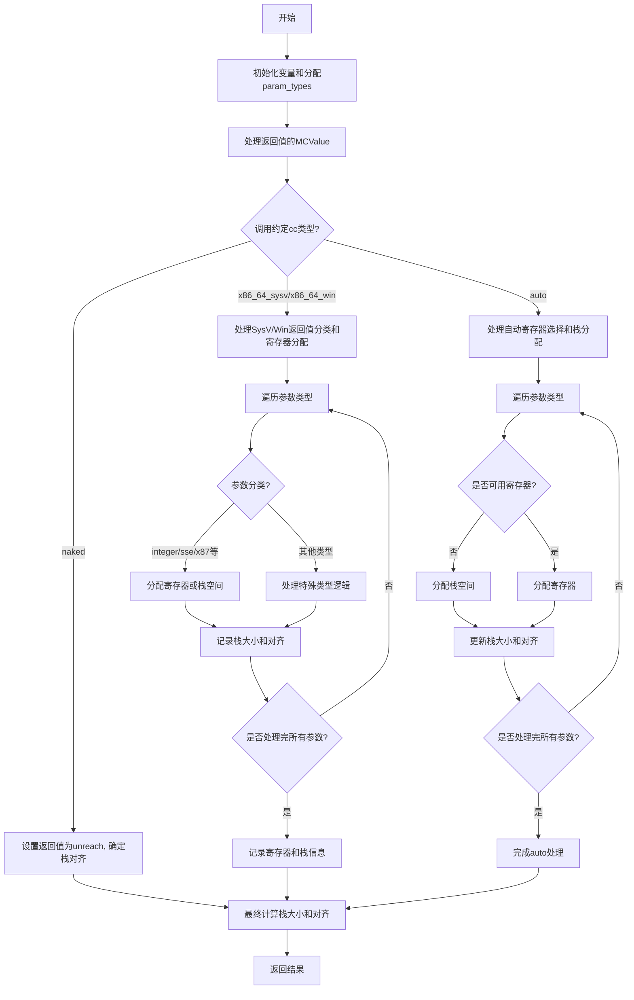

嗯，我需要画这个函数的流程图。首先，我得理解这个函数是做什么的。看起来像是处理函数调用约定，生成机器代码值。函数名是resolveCallingConventionValues，属于x86_64架构的代码生成部分。

首先，函数开始部分有一些参数和变量的初始化，比如param_types的分配，然后处理返回值和参数。接下来根据不同的调用约定（cc）处理不同的情况，比如.naked、.x86_64_sysv、.x86_64_win、.auto等。

对于每个调用约定，处理返回值和参数的方式不同。例如，在.naked情况下，直接设置返回值为unreach，并确定栈对齐。在.x86_64_sysv和.x86_64_win中，处理返回值的寄存器分配，以及参数的寄存器或栈位置分配。.auto的情况似乎更复杂，涉及到寄存器的选择和栈的对齐。

我需要将每个分支拆分成流程图的节点，比如开始、处理参数类型、处理不同调用约定、处理返回值和参数分配，最后确定栈大小和对齐。

需要注意的是，有些部分可能涉及条件判断，比如根据cc的不同进入不同的处理分支。此外，循环处理参数类型，逐个分配寄存器或栈位置。

可能的结构是：

1. 函数开始，初始化变量。
2. 分配param_types数组。
3. 处理返回值的MCValue。
4. 根据调用约定cc进入不同的处理分支。
5. 在每个分支中，处理返回值和参数的寄存器分配或栈分配。
6. 处理完所有参数后，计算栈的大小和对齐。
7. 返回结果。

需要注意错误处理部分，比如errdefer释放内存，但流程图可能不需要详细展示错误路径，除非特别重要。

可能需要用条件判断节点来表示不同的cc情况，然后每个情况下的子流程。例如，对于.x86_64_sysv，处理返回值的分类和寄存器的分配，然后处理每个参数的分类，分配寄存器或栈空间。

在流程图中，可能需要用菱形表示条件判断，矩形表示处理步骤，箭头表示流程方向。每个主要分支（如不同的cc）需要分开处理。

可能需要将整个流程分解为几个主要部分：初始化、处理返回类型、处理参数、处理不同调用约定、最终计算栈信息。

现在，我需要将这些步骤转化为mermaid的流程图语法，确保每个步骤和分支正确表示。
================================================

流程说明：
1. 函数初始化变量，合并固定参数和可变参数类型到`param_types`数组。
2. 根据不同的调用约定（naked/SysV/Win/auto）进入不同分支：
   - **naked**：直接设置不可达返回值并确定栈对齐。
   - **SysV/Win**：通过ABI分类系统处理返回值和参数，按整数/SSE/X87等类型分配寄存器或栈空间。
   - **auto**：动态选择寄存器（优先使用GPR/X87/SSE），剩余参数压栈。
3. 所有分支最终统一计算栈总大小和对齐要求。
4. 最终返回包含寄存器分配、栈布局等信息的`CallMCValues`结构。