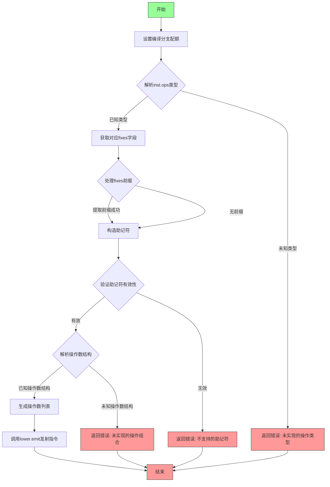

嗯，我现在需要根据提供的Zig代码画出这个函数的流程图。首先，我得理解这个函数的结构和逻辑。这个函数名为`generic`，接受一个`Lower`类型的指针和一个`Mir.Inst`类型的参数，返回一个错误或`void`。看起来像是用来处理不同指令操作类型的分发和处理的。

首先，函数开始处设置了`@setEvalBranchQuota(2500);`，这是Zig中的编译时分支配额设置，可能为了防止编译时无限递归或者过深的计算，不过这对流程图影响不大，可能不需要特别处理。

接下来，`const fixes = switch (inst.ops) { ... }`，这里根据`inst.ops`的不同值，选择不同的`fixes`。每个case对应不同的操作类型，比如`.none`、`.inst`、`.i_s`等等。这里需要注意每个分支对应的`fixes`的获取方式，比如`inst.data.none.fixes`、`inst.data.inst.fixes`等。最后一个`else`分支如果遇到未处理的操作类型，会返回一个错误。

然后，函数调用`try lower.emit(...)`，这里参数比较复杂。首先是一个`switch (fixes)`，使用`inline else`遍历所有可能的`fixes`标签，处理前缀。接着是`mnemonic`的计算部分，这里用了`comptime`变量和字符串操作来生成mnemonic名称，如果找不到对应的枚举值，会返回错误。最后是另一个`switch (inst.ops)`，处理不同的操作类型，生成对应的操作数列表。

在第二个`switch (inst.ops)`中，每个case对应不同的操作数结构，比如`.none`对应空列表，`.inst`处理立即数，`.i_s`和`.i_u`处理立即数，`.ii`处理两个立即数，依此类推。每个case生成一个操作数数组，可能包含寄存器、内存地址或立即数。最后的`else`分支同样返回错误。

现在需要考虑如何将这段代码转化为流程图。通常流程图包括开始、判断、处理步骤、结束等部分。这里有几个主要的判断点：

1. 根据`inst.ops`选择`fixes`。
2. 处理`fixes`以确定前缀。
3. 生成`mnemonic`。
4. 根据`inst.ops`生成操作数列表。
5. 处理可能出现的错误。

流程图的步骤可能如下：

- 开始
- 设置分支配额（可能忽略）
- 根据`inst.ops`选择`fixes`，如果未处理的操作类型，跳转到错误处理
- 处理`fixes`得到前缀
- 生成`mnemonic`，如果失败则跳转到错误处理
- 根据`inst.ops`生成操作数列表，如果未处理的操作类型，跳转到错误处理
- 调用`lower.emit`，传递前缀、mnemonic和操作数
- 结束或返回错误

需要注意的是，代码中有多个可能返回错误的地方，比如在`fixes`的`else`分支、生成mnemonic失败、以及操作数处理中的`else`分支。这些错误路径需要在流程图中体现。

另外，`mnemonic`的生成部分使用了编译时计算，可能比较复杂，但在流程图中可以简化为一个判断步骤，即尝试生成mnemonic名称并查找对应的枚举值，失败则返回错误。

对于操作数列表的生成，每个`inst.ops`的case对应不同的处理逻辑，可能需要多个分支。不过在流程图中，可以简化为一个大的判断结构，每个case对应生成相应的操作数，然后继续流程。

总结下来，流程图的主要结构是：

开始 → 选择fixes → 处理fixes前缀 → 生成mnemonic → 生成操作数 → 调用emit → 结束

中间的每个步骤都可能出现错误分支，跳转到错误处理并返回。

现在需要将这些步骤转化为mermaid流程图。需要注意的是mermaid的语法结构，如节点、条件判断、子流程等。可能的节点包括操作步骤、判断分支、错误处理等。由于代码中有多个switch语句，可能需要使用多个判断节点。

可能的结构：

graph TD
    A[开始] --> B{根据inst.ops选择fixes}
    B -->|已知类型| C[获取对应的fixes]
    B -->|未知类型| D[返回错误]
    C --> E{处理fixes得到前缀}
    E --> F[生成mnemonic]
    F -->|成功| G{根据inst.ops生成操作数}
    F -->|失败| D
    G -->|已知类型| H[生成操作数列表]
    G -->|未知类型| D
    H --> I[调用lower.emit]
    I --> J[结束]
    D --> K[返回错误]

不过可能需要更详细的分支，尤其是处理fixes和生成mnemonic的部分。例如，处理fixes的switch可能涉及多个分支，但根据代码中的switch，每个分支直接获取fixes，所以可以简化为一个步骤。生成mnemonic的部分涉及字符串操作和查找枚举值，可以视为一个步骤，失败则跳转到错误。

另外，在生成操作数时，每个inst.ops的case对应不同的处理，可能需要多个子步骤，但在流程图中可以简化为一个判断节点，每个分支处理不同的情况，但最终都生成操作数列表。

可能还需要将错误处理集中，比如所有错误路径都指向同一个错误节点，然后返回错误。

最终的mermaid流程图可能如下：

```mermaid
graph TD
    Start[开始] --> SetBranchQuota[设置@setEvalBranchQuota]
    SetBranchQuota --> SelectFixes{根据inst.ops选择fixes}
    SelectFixes --> |已知类型| GetFixes[获取对应fixes]
    SelectFixes --> |else| Error1[返回错误: TODO lower .{s}]
    GetFixes --> ProcessPrefixes{处理fixes得到前缀}
    ProcessPrefixes --> |inline else| DeterminePrefix[确定前缀]
    DeterminePrefix --> GenerateMnemonic[生成mnemonic]
    GenerateMnemonic --> |成功| SelectOperands{根据inst.ops生成操作数}
    GenerateMnemonic --> |失败| Error2[返回错误: 不支持的mnemonic]
    SelectOperands --> |已知类型| BuildOperands[构建操作数列表]
    SelectOperands --> |else| Error3[返回错误: TODO lower {s} {s}]
    BuildOperands --> Emit[调用lower.emit]
    Emit --> End[结束]
    Error1 --> ReturnError[返回错误]
    Error2 --> ReturnError
    Error3 --> ReturnError
    ReturnError --> End
```

这里的每个错误情况都指向ReturnError节点，然后结束。可能需要注意每个错误的具体信息，但为了简化，可以统一处理。此外，`ProcessPrefixes`中的`inline else`可能涉及循环处理所有可能的`fixes`标签，但在流程图中可以简化为一个步骤。

可能还需要调整节点名称和结构，确保准确反映代码逻辑。例如，生成mnemonic的步骤包括拼接字符串和查找枚举值，失败则返回错误。操作数生成部分的每个case对应不同的处理，但统一归为已知类型，否则错误。
================================================
