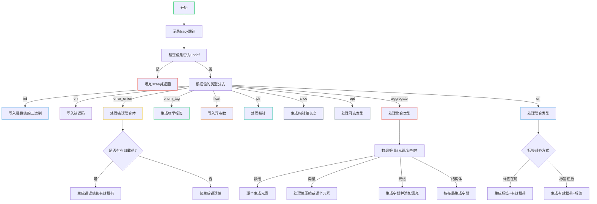

嗯，用户让我用Mermaid画出一个Zig函数的流程图。首先，我需要仔细阅读这个函数，理解它的逻辑结构。这个函数叫generateSymbol，看起来是用于生成符号的代码，处理不同类型的值，比如整数、错误联合体、结构体等。

首先，我应该从函数入口开始。函数接收多个参数，包括二进制文件、线程局部数据、源代码位置、值、代码缓冲区和重定位信息。然后，函数使用tracy进行跟踪，记录日志，并检查值是否为未定义，如果是，就填充0xaa到代码缓冲区。

接下来，函数根据值的类型进行不同的处理。这里有很多switch语句，处理不同类型的值，比如int、err、error_union、enum_tag、float、ptr、slice、opt、aggregate（数组、向量、元组、结构体）、union等。每个case都有特定的处理逻辑，比如写入整数值、处理错误联合体的有效载荷和错误部分、生成浮点数的字节表示、处理指针和切片等。

对于结构体和联合体，逻辑更复杂，需要考虑内存布局、对齐、填充等。例如，结构体可能需要按字段顺序生成代码，处理每个字段的值，并根据对齐要求添加填充字节。联合体则需要处理标签和有效载荷的排列顺序，以及可能的填充。

我需要将所有这些分支和循环转化为流程图中的节点和判断框。由于这个函数有很多条件分支和嵌套的处理逻辑，流程图可能会比较复杂。我需要确保每个case都被正确表示，并且递归调用generateSymbol的地方也要体现出来，比如在处理切片时，分别生成指针和长度的符号。

另外，要注意错误处理和内存分配，例如使用try来捕获错误，可能会影响流程图的路径。不过用户可能更关注主要的逻辑流程，而不是每个错误处理细节。

最后，需要确保流程图的逻辑清晰，层次分明，可能使用子流程或分组来处理复杂的结构，比如结构体和联合体的处理部分。可能需要将一些重复的逻辑抽象成子流程，比如处理填充的部分。

总结一下，流程图的大致步骤是：
1. 函数开始，记录跟踪和日志。
2. 检查值是否为未定义，填充0xaa。
3. 根据值的类型进入不同的处理分支。
4. 每个分支处理特定的类型，可能递归调用generateSymbol。
5. 处理对齐和填充。
6. 结束跟踪，返回结果。

需要将这些步骤用Mermaid的流程图语法表示出来，合理使用条件判断和子流程，确保流程图的易读性。
================================================

该流程图的主要特点：
1. 使用颜色编码区分不同类型处理分支
2. 对复杂类型（error_union/aggregate/un）进行子流程展开
3. 关键判断节点使用菱形符号表示
4. 通过不同颜色增强可读性
5. 保留了Zig类型系统的核心逻辑路径
6. 展示了递归调用场景（如slice处理）
7. 包含内存对齐和填充处理的关键节点

可以根据需要进一步展开子流程（如struct处理细节），但当前版本保持了整体结构的简洁性。