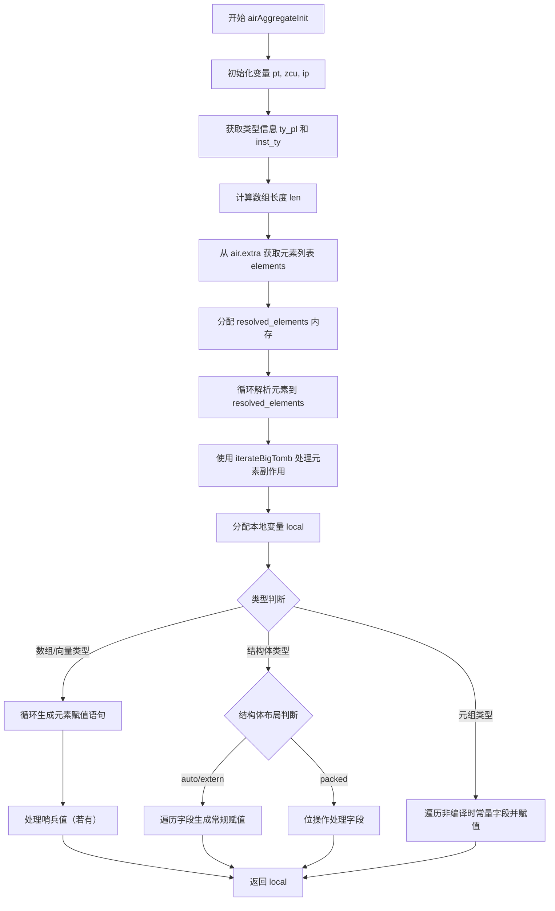

嗯，我需要帮用户用Mermaid画出一个Zig函数的流程图。首先，我需要仔细阅读这个函数，理解它的结构和逻辑流程。

函数名是airAggregateInit，看起来是初始化某种聚合类型，比如数组、结构体或元组。函数的参数是一个Function指针和一个指令索引，返回一个CValue或者错误。接下来，函数内部定义了一些变量，比如pt、zcu、ip，这些可能是上下文相关的结构体或指针。

函数开始获取类型信息ty_pl和inst_ty，然后确定数组的长度len。接着从air.extra中获取元素列表elements。然后分配内存给resolved_elements，用来存储解析后的元素值。之后，通过循环遍历每个元素，调用f.resolveInst解析每个元素，并将结果存入resolved_elements。

接下来有一个大括号块，里面用iterateBigTomb处理每个元素，可能是处理指令的副作用或依赖关系。

然后，函数分配一个本地变量local，可能是用来存储最终生成的C值。根据不同的类型（数组、向量、结构体、元组等），生成不同的C代码。这里用到了switch语句，处理不同类型的初始化逻辑。

对于数组和向量类型，循环遍历每个元素，生成对应的C数组赋值语句。如果有哨兵值（sentinel），则额外处理最后一个元素。

对于结构体类型，分为自动布局、extern布局和打包布局（packed）。自动和extern布局时，遍历结构体的字段，逐个赋值。打包布局时，处理位字段，可能需要位移和掩码操作，生成位操作的表达式。

对于元组类型，遍历每个字段，处理非编译时常量的字段，生成对应的赋值语句。

最后，返回本地变量local作为结果。

现在需要将这些步骤转化为流程图。流程图应该从函数入口开始，依次展示各个主要步骤，包括变量初始化、解析元素、处理副作用、分配本地变量，然后根据类型分支处理不同的初始化逻辑，最后返回结果。

需要注意的是，处理不同结构体布局的部分可能需要子流程，尤其是打包布局的情况，涉及到位操作和循环生成表达式。此外，每个case分支（数组、结构体、元组）应有对应的处理步骤，用条件判断来区分。

可能会遇到的难点是如何简洁地表示复杂的逻辑分支，尤其是结构体的不同布局处理，以及循环和条件嵌套。需要确保流程图清晰，层次分明，避免过于复杂。

总结步骤：
1. 开始函数。
2. 初始化变量（pt, zcu, ip等）。
3. 获取类型信息和元素列表。
4. 解析每个元素到resolved_elements。
5. 处理元素的副作用（iterateBigTomb）。
6. 分配本地变量local。
7. 根据类型进行分支处理：
   a. 数组/向量：逐个元素赋值，处理哨兵。
   b. 结构体：
      i. 自动/extern布局：遍历字段赋值。
      ii. 打包布局：位操作处理字段。
   c. 元组：遍历字段赋值。
8. 返回local。

流程图应按照上述步骤展开，用条件判断来区分不同类型，并在每个分支内展示对应的处理步骤。
================================================
