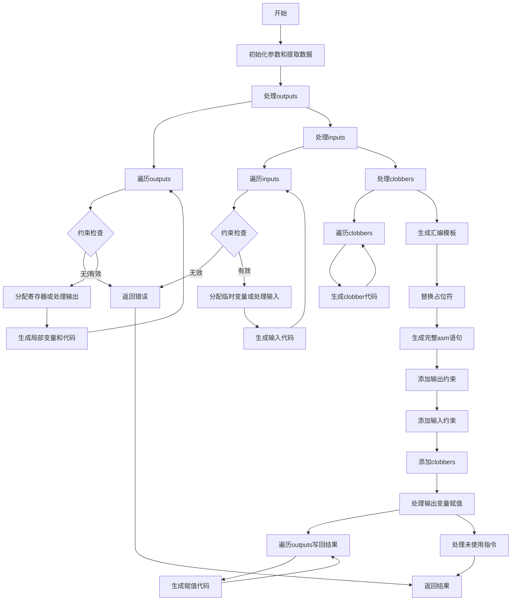

嗯，我现在需要给这个Zig函数`airAsm`画一个流程图。首先，我应该通读代码，理解每个部分的功能，然后逐步拆解流程。

函数开始的时候，获取了一些指针和参数，比如`f`和`inst`。接着从`f.air`中提取了`ty_pl`和`extra`数据，包括判断是否是volatile和clobbers的长度。然后处理outputs和inputs的数组，这里可能是在处理内联汇编的输出和输入操作数。

接下来是`result`块，这里处理了类型和局部变量的分配，可能涉及到生成C代码前的准备工作。然后开始遍历outputs，处理每个输出的约束条件，比如检查约束格式是否正确，是否为寄存器约束，然后分配局部变量并生成对应的C代码。类似地，处理inputs时，同样检查约束条件，可能需要为输入分配临时变量。

之后处理clobbers，这部分可能是在处理被内联汇编修改的寄存器列表。然后处理汇编源代码，替换其中的占位符，生成正确的汇编字符串。

接下来生成`__asm__`语句，包括volatile关键字、汇编模板、输出、输入和clobbers部分。这里需要将之前处理的outputs和inputs的约束和变量引用到汇编语句中。

最后，处理输出变量的赋值，将寄存器的值写回到目标变量中。然后处理未使用的指令，返回结果。

在画流程图的时候，应该按照这些步骤来分块，每个条件判断和循环都需要表示出来。例如，处理outputs和inputs时的循环，条件判断是否是寄存器约束，是否需要分配局部变量等。同时，错误处理部分，比如`return f.fail`的地方，也需要在流程图中体现。

可能的结构是：

1. 初始化步骤：获取参数，提取数据。
2. 处理outputs：遍历每个输出，检查约束，分配变量。
3. 处理inputs：类似outputs的处理。
4. 处理clobbers。
5. 生成汇编模板字符串。
6. 生成完整的asm语句，包括输出、输入、clobbers。
7. 处理输出变量的赋值。
8. 处理未使用的指令，返回结果。

每个步骤中的条件和循环需要用判断框和循环框表示。例如，处理outputs时有一个循环，每个循环内部检查约束是否有效，是否是寄存器约束，然后分配变量等。

需要注意错误处理的分支，比如当约束不符合要求时，函数会返回错误，这在流程图中应该有对应的箭头指向错误结束。

可能还需要考虑变量的作用域，比如`locals_begin`和`locals_index`的管理，这些在流程中如何体现。

最终，流程图应该清晰地展示函数的执行路径，包括主要步骤、循环、条件判断和错误处理。
================================================

流程图说明：
1. **初始化阶段**：提取内联汇编指令相关参数和元数据
2. **输出处理循环**：
   - 检查每个输出操作数的约束条件
   - 为寄存器约束分配专用变量
   - 生成C代码中寄存器绑定逻辑
3. **输入处理循环**：
   - 类似输出处理的约束检查流程
   - 处理需要临时变量的输入场景
4. **clobber处理**：
   - 生成被破坏寄存器列表
5. **汇编模板生成**：
   - 处理特殊占位符语法（如%[name]）
   - 构造最终asm语句字符串
6. **完整asm语句生成**：
   - 组合volatile修饰符
   - 拼接输出/输入/clobber约束条件
7. **后处理阶段**：
   - 将寄存器结果写回目标变量
   - 处理指令未使用的情况
   - 最终返回代码生成结果

所有步骤中都包含错误检查分支，遇到不支持的约束条件会提前终止流程。