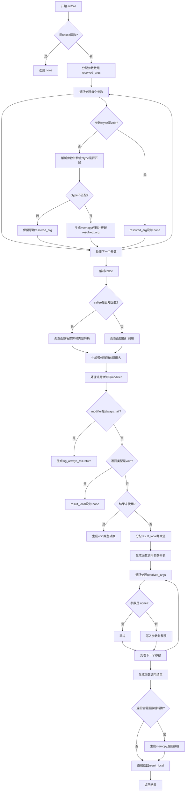

好的，我需要为这个Zig函数`airCall`绘制一个流程图。首先，我得仔细阅读代码，理解每个步骤的作用和逻辑分支。函数的主要功能是处理函数调用，生成相应的C代码。看起来有几个关键部分：处理参数、处理调用者（callee）、处理返回值，以及各种条件判断，比如是否是naked函数、返回类型是否为void等。

首先，流程图应该从函数入口开始，检查是否是naked函数，如果是则直接返回。接下来处理参数，可能涉及内存拷贝。然后处理callee，可能有不同的情况，比如直接调用函数或者通过函数指针，还有不同的调用修饰符（modifier）。处理完调用后，处理返回值，可能需要复制内存或者直接返回。

需要注意条件分支，例如检查`modifier`是否为`.always_tail`，返回类型是否为`void`，以及是否需要类型转换等。每个条件分支都应该在流程图中体现出来。另外，错误处理部分，比如`try`可能会抛出错误，但流程图中可能不需要显示错误路径，除非特别重要。

需要确定各个步骤的顺序和条件，使用菱形表示判断，矩形表示处理步骤，箭头连接流程。可能需要将代码分段，逐步转化为流程图中的各个节点。例如：

1. 检查是否是naked函数，如果是，返回none。
2. 分配参数数组，解析每个参数，可能需要memcpy。
3. 解析callee，处理不同的callee类型（已知函数、函数指针等）。
4. 根据modifier和返回类型处理结果局部变量。
5. 生成函数调用代码，处理参数传递。
6. 处理返回值，可能需要再次memcpy。

每个步骤中的条件判断需要正确连接。例如，参数处理时，如果ctype是void则跳过；callee处理时，是否有已知值需要不同处理等。

需要确保流程图的逻辑与代码一致，没有遗漏重要的分支或步骤。可能需要多次阅读代码，确认每个条件分支的处理方式。此外，注意循环结构，例如for循环处理参数数组，但在流程图中通常用单一节点表示循环过程，可能用“循环处理每个参数”这样的节点。

最后，确保流程图的结构清晰，层次分明，方便理解函数的整体流程。
================================================
