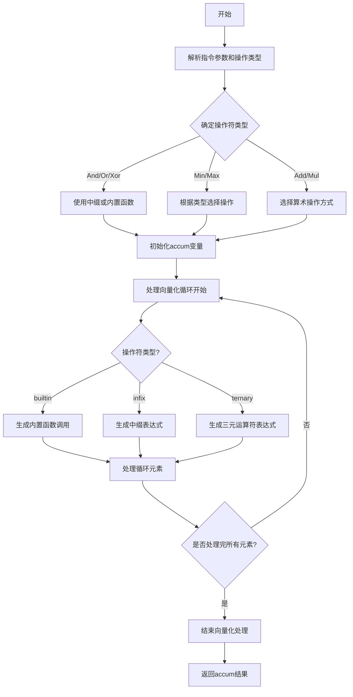

嗯，我需要为这个Zig函数`airReduce`画一个流程图。首先，我得理解这个函数的功能和结构。看起来这个函数处理某种中间表示（Air）的reduce操作，生成对应的C代码。函数开始时会解析一些参数，比如操作类型（reduce.operation），然后根据不同的操作类型选择不同的代码生成策略，比如使用内置函数、中缀运算符或三元运算符。接着，它会初始化一个累加器（accum），然后根据操作类型生成相应的C代码来进行向量化处理，最后返回这个累加器。

首先，我需要确定主要的流程步骤。函数开始后，会处理指令，解析操作类型，确定使用哪种操作符或内置函数。然后初始化accum变量，根据不同的操作设置初始值。接着处理向量化，生成对应的C代码表达式，最后结束向量化处理并返回结果。

接下来，我需要将这些步骤转化为流程图中的各个节点。可能的节点包括：解析指令、确定操作类型、初始化accum、处理向量化循环、生成表达式、结束处理。每个判断点，比如根据操作类型选择不同的路径，需要用条件分支表示。

需要注意的是，代码中有多个条件判断，比如根据`reduce.operation`的不同（如And、Or、Xor等），以及根据`scalar_ty`的类型（int、float等）选择不同的操作方式。这些都需要在流程图中体现为不同的分支。

另外，处理向量化（Vectorize.start和v.end）的部分可能需要循环结构，表示对每个元素进行处理。

可能遇到的难点是如何将复杂的条件分支和循环结构准确地用流程图表示出来，同时保持图的清晰和易读。需要确保每个条件分支都有明确的判断标准，并且流程的走向符合代码的逻辑。

最后，根据上述分析，用Mermaid语法绘制出流程图，确保每个步骤和条件分支都正确对应代码中的逻辑。
================================================
