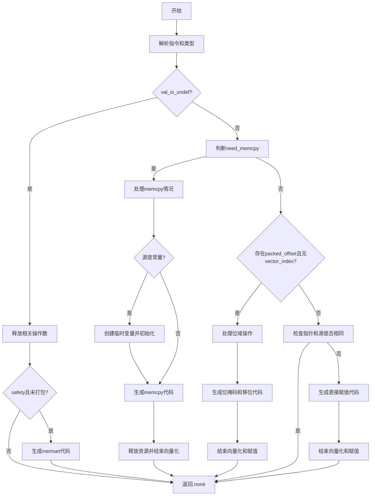

好的，我现在需要为提供的Zig代码中的`airStore`函数绘制流程图。首先，我需要理解这个函数的功能和结构。

首先，函数`airStore`处理存储操作，类似于`*a = b`。它接受函数指针、指令索引和安全标志，返回CValue或错误。代码中涉及解析二元操作，处理指针类型，检查值是否为未定义，以及根据不同情况生成C代码，比如使用memcpy或直接赋值。

接下来，我需要逐步分析代码的逻辑流程：

1. **解析指令和类型**：函数开始处获取二元操作的操作数，解析指针类型和源类型。
2. **处理未定义值**：如果右侧的值是未定义的，根据安全标志决定是否使用memset初始化内存。
3. **判断是否需要memcpy**：检查对齐和数组类型，确定是否需要使用memcpy。
4. **处理memcpy情况**：如果源是常量，创建临时变量，然后生成memcpy代码。
5. **处理位域打包情况**：处理带有位偏移的情况，生成位操作和掩码处理。
6. **默认赋值情况**：直接生成赋值语句，考虑向量化。

需要注意条件分支，比如`val_is_undef`、`need_memcpy`、`packed_offset`处理等。每个分支有不同的代码生成逻辑。

在绘制流程图时，应将这些步骤转化为决策节点和过程节点。可能的节点包括：

- 开始
- 解析指令和类型
- 检查val_is_undef
  - 是：处理未定义值，可能使用memset
  - 否：继续
- 检查need_memcpy
  - 是：处理memcpy逻辑
  - 否：检查packed_offset和vector_index
    - 处理位域操作
    - 否则默认赋值
- 结束

需要注意循环或向量化处理部分，但代码中的Vectorize可能通过循环展开处理，流程图中可能表示为并行处理步骤。

现在，根据以上分析，用Mermaid语法构建流程图，确保各条件分支正确连接，步骤清晰。
================================================
