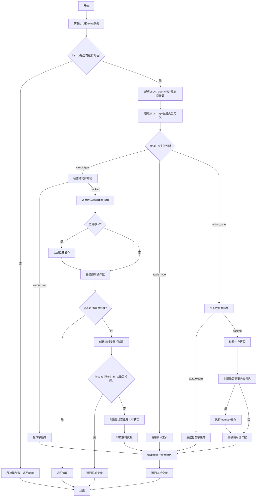

好的，我需要为提供的Zig函数`airStructFieldVal`绘制一个流程图。首先，我得仔细理解这个函数的结构和逻辑。

函数开始部分处理了一些类型和参数的初始化，比如获取`ty_pl`和`extra`数据。然后检查`inst_ty`是否有运行时位，如果没有的话，就直接返回`.none`。

接下来，函数解析`struct_operand`，并处理结构体类型的不同布局情况：auto、extern、packed。对于packed布局，涉及到位偏移和类型转换，生成相应的C代码。这里可能需要处理不同类型的位操作，比如位移和类型包装。

在处理联合类型（union_type）时，根据布局不同，生成不同的字段名，或者处理内存拷贝。特别是当布局为packed时，需要复制内存内容。

最后，分配本地变量，处理赋值操作，并返回结果。

现在，我需要将这个过程转化为流程图。需要考虑各个条件分支，比如结构体类型的不同布局（auto/extern vs packed），联合类型的不同处理，以及可能的错误情况（如超过64位的转换问题）。

可能的步骤包括：

1. 开始函数，初始化变量。
2. 检查`inst_ty`是否有运行时位，如果没有则释放操作数并返回none。
3. 解析结构体操作数，释放已使用的操作数。
4. 根据结构体类型的不同布局进行处理：
   - auto/extern：生成字段名。
   - packed：处理位偏移，生成临时变量，进行位移和类型转换，处理可能的错误（如超过64位）。
5. 如果是元组类型，直接使用字段索引。
6. 如果是联合类型，根据布局处理：
   - auto/extern：生成相应的字段名。
   - packed：处理内存拷贝。
7. 分配本地变量，进行赋值操作，返回结果。

需要注意错误处理分支，比如当位转换超过64位时返回错误。另外，内存拷贝的条件判断，以及临时变量的管理也需要在流程图中体现。

最后，确保各个分支正确连接，流程图的开始和结束点明确。
================================================
