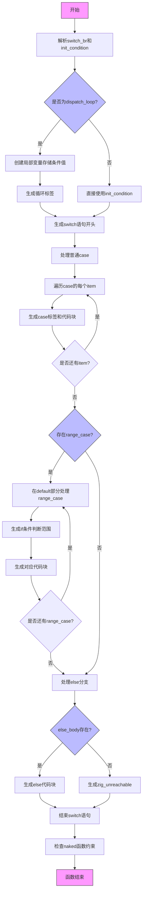

好的，我需要为给定的Zig函数`airSwitchBr`绘制流程图。首先，我得理解这个函数的功能和结构。看起来这个函数处理switch分支的代码生成，可能用于将Zig的switch语句转换为C代码。函数参数中有`is_dispatch_loop`，说明可能有不同的处理逻辑用于调度循环。

首先，函数开始部分处理了条件表达式的解析和初始化。如果`is_dispatch_loop`为真，会创建一个局部变量来存储条件值，并生成对应的循环标签。然后根据条件类型进行类型转换，生成switch语句的开头。

接下来，处理各个case。分为两种情况：普通case和带有范围（range）的case。普通case直接生成对应的case标签和代码块；范围case则在default部分处理，使用if语句来判断范围条件。

然后处理else分支，如果没有else且是dispatch循环，可能需要生成不可达的代码。最后结束switch语句，处理缩进和结构。

流程图需要涵盖以下步骤：
1. 初始化条件表达式，处理dispatch循环的情况。
2. 生成switch语句的开头。
3. 遍历所有case，生成对应的case标签和代码块。
4. 处理带有范围的case，在default部分生成条件判断。
5. 处理else分支或生成不可达代码。
6. 结束switch语句。

需要注意条件分支、循环处理、不同类型的case处理以及错误检查（如naked函数中的运行时代码检查）。

可能需要使用不同的节点表示条件判断、循环处理、case生成等步骤，并用箭头连接这些步骤，包括可能的分支路径。此外，错误处理部分也需要在流程图中体现，比如`f.fail`的调用。

现在根据这些步骤，用mermaid语法构建流程图。确保每个主要步骤都有对应的节点，逻辑分支正确连接，特别是处理普通case和范围case的不同路径，以及else分支的处理。
================================================

流程说明：
1. 函数初始化条件值并处理dispatch_loop的特殊逻辑
2. 生成switch语句框架后分两条路径：
   - 普通case直接生成C语言的case标签
   - 范围case在default分支用if链处理
3. 最后处理else分支或插入不可达断言
4. 始终检查是否违反naked函数限制
5. 菱形节点表示条件判断，矩形为操作步骤，箭头表示执行顺序