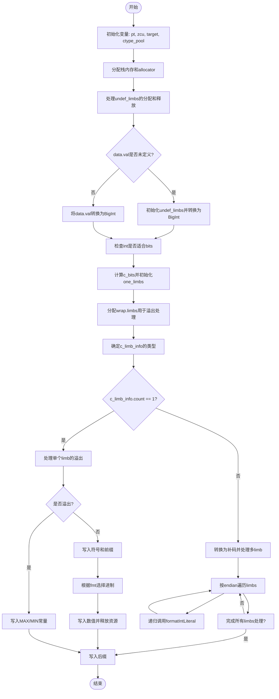

嗯，我需要帮用户把这段Zig代码转换成Mermaid流程图。首先，我得仔细看看这个函数是做什么的。函数名是formatIntLiteral，看起来是格式化整数字面量的。函数参数有data、fmt、options和writer，返回类型是一个可能的错误或者void。

首先，我需要理解函数的结构。函数开始部分定义了一些变量，比如pt、zcu、target、ctype_pool。然后有一个ExpectedContents的结构体，用于栈上分配内存。接着使用stackFallback分配器，处理undef_limbs的分配和释放。

接下来，处理data.val是否为UndefDeep，如果是的话，分配undef_limbs并初始化，否则转换成BigInt。然后检查int是否适合指定的位数和有符号性。

然后处理c_bits，计算C类型的位数。初始化one_limbs和one，用于后续的加法或减法操作。接着定义wrap变量，用于处理整数溢出的情况。

之后，根据data.ctype的类型（如基本类型、数组等）确定c_limb_info的信息，包括ctype、count、endian和homogeneous。这里有一个switch语句，处理不同的ctype情况。

如果c_limb_info.count为1，处理单个limb的情况，包括处理溢出，写入MAX或MIN，处理符号，写入前缀，根据格式（如二进制、八进制、十进制、十六进制）写入相应的前缀和数值。这里还处理了不同进制的格式，比如0b、0、0x等。

如果c_limb_info.count不为1，即处理多个limb的情况，比如数组类型。这时需要将整数转换为补码形式，并根据endian处理每个limb，递归调用formatIntLiteral处理每个limb的值，最后写入后缀。

整个函数的流程可以分为几个主要部分：初始化变量，处理Undef情况，处理整数转换和溢出，根据不同的类型和格式生成对应的字符串表示，处理多limb的情况，递归处理每个limb，最后写入后缀。

接下来，我需要将这些步骤转化为Mermaid的流程图。流程图应该包括开始和结束节点，条件判断（如if-else），循环（如while），函数调用（如writer.print），以及各个处理步骤。

需要注意的是，流程图中需要处理条件分支，比如c_limb_info.count是否为1，不同的fmt格式，是否处理多limb的情况等。递归调用formatIntLiteral的部分可能需要特殊处理，或者用子流程表示。

可能的结构：

1. 开始节点
2. 初始化变量（pt, zcu, target, ctype_pool）
3. 分配栈内存和allocator
4. 处理undef_limbs
5. 处理int的转换（Undef或正常值）
6. 检查int是否适合bits
7. 计算c_bits
8. 初始化one_limbs和one
9. 分配wrap.limbs
10. 确定c_limb_info
11. 判断c_limb_info.count是否为1
   - 是：处理单个limb的情况（溢出检查，写入MAX/MIN，符号，前缀，格式处理，写入数值）
   - 否：处理多个limb（转换为补码，处理每个limb，递归调用）
12. 写入后缀
13. 结束节点

其中，条件判断需要用菱形节点，循环用循环节点，步骤用矩形节点。递归调用可能需要用一个子流程或者单独节点表示。

需要确保所有可能的路径都被覆盖，比如不同的fmt情况（'b', 'o', 'd', 'x', 'X'），以及不同的ctype类型（basic, array等）。

可能还需要处理错误情况，比如writer.print可能返回错误，但函数返回的是错误联合类型，不过流程图中可能不需要详细展示错误处理，除非用户特别要求。

最终，将上述步骤转化为Mermaid语法，注意节点之间的连接和条件分支的箭头标注。
================================================
