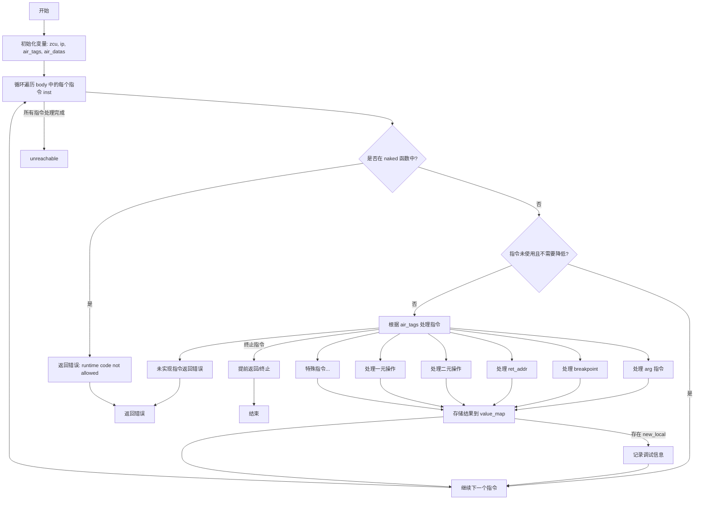

好的，我现在需要帮助用户用Mermaid画出给定Zig函数的流程图。首先，我需要理解这个函数的结构和逻辑。

函数名为`genBodyInner`，看起来是处理某种中间表示（可能是AIR，即Zig的高级中间表示）并生成相应的代码。函数接收一个`Function`指针`f`和一个`body`参数，里面包含指令索引。函数返回一个错误联合类型，可能抛出`AnalysisFail`或`OutOfMemory`错误。

首先，函数开始处获取了一些上下文信息，比如`zcu`、`ip`、`air_tags`和`air_datas`。然后进入一个循环，遍历`body`中的每个指令`inst`。

接下来有几个条件判断：检查是否在naked函数中不允许运行时代码，以及指令是否未被使用且不需要被降低。如果满足这些条件，就跳过当前指令。

然后，针对每个指令，使用`switch`语句根据`air_tags`中的指令类型进行不同的处理。每个case调用不同的函数，比如`airArg`、`airBreakpoint`等。某些case会直接返回错误或未实现的功能，比如`.addrspace_cast`返回TODO错误。

在处理完每个指令后，将结果存入`value_map`中，根据`result_value`的类型决定是继续循环还是处理其他情况。最后，循环结束后有一个`unreachable`，可能表示正常情况下不应该到达这里，或者有其他退出路径。

接下来，我需要将这些逻辑步骤转化为流程图。需要考虑循环结构、条件判断、错误处理以及各个指令的处理分支。

流程图的起点是函数开始，初始化变量，然后进入循环。循环内部检查两个条件：是否在naked函数中，以及指令是否被使用。如果条件满足，可能直接返回错误或跳过指令。之后根据指令类型进行分支处理，每个分支可能调用不同的函数或处理逻辑。处理完成后，将结果存入map，并继续循环。

需要注意的是，有些case会导致函数提前返回（如`.br`指令），而其他case则继续处理。此外，循环结束后有一个`unreachable`，可能需要标注。

可能的结构：

1. 开始
2. 初始化变量（zcu, ip, air_tags, air_datas）
3. 循环遍历body中的每个inst
   a. 检查是否在naked函数中，如果是则返回错误
   b. 检查指令是否未被使用且不需要降低，如果是则跳过
   c. 根据air_tags的指令类型进行switch分支
      i. 每个case对应的处理函数或错误
   d. 处理结果存入value_map
4. 循环结束，执行unreachable

需要将switch中的各个分支简化为一个判断框，可能不需要详细列出每个case，而是概括为处理不同指令类型的分支。同时，处理过程中可能出现的错误返回也需要在流程图中体现。

此外，某些指令会导致提前返回（如br, ret等），这些需要在流程图中标注为终止节点。

最后，生成Mermaid代码时，需要使用合适的节点和箭头连接各个步骤，确保逻辑清晰。
================================================
