嗯，我需要为这个Zig函数画一个流程图。首先，我得理解这个函数的结构。函数的名字是dataLayout，接受一个target参数，返回一个字符串。看起来是根据不同的CPU架构和其他条件返回不同的数据布局字符串。

首先，函数开始于一个switch语句，根据target.cpu.arch的值进行分支。每个分支对应不同的架构，比如.arc、.xcore、.hexagon等。每个case返回特定的字符串。有些情况下，还会嵌套if语句，进一步根据target的其他属性（比如os.tag、ofmt、abi等）进行判断。例如，在.aarch64的情况下，会检查是否是macho格式，或者是否是Windows操作系统，或者是否是ilp32 ABI。

我需要把这些逻辑分支都画出来。可能的结构是，最外层的switch对应不同的架构，每个架构下可能有多个条件判断，比如if-else链或者嵌套的switch。例如，.powerpc64的情况里还有一个switch检查target.os.tag，而.x86的情况里也有多个嵌套的条件。

流程图应该从函数入口开始，判断target.cpu.arch，然后根据不同的arch进入对应的分支。每个分支内部再根据其他条件细化。比如，对于aarch64，先判断是否是macho，如果是，再判断是否是Windows，再判断abi是否是ilp32，以此类推。

需要注意的是，有些架构的处理比较简单，直接返回字符串，而有些则需要多层条件判断。例如，.x86的情况比较复杂，涉及多个os.tag和abi的判断，还有ofmt是否为coff或macho等。

在画流程图的时候，可能需要为每个主要的arch分支创建一个子流程图，特别是那些有嵌套条件的。例如，aarch64、arm、thumb、x86、x86_64等都需要详细的分支处理。

另外，最后的几个架构如.kalimba、.propeller会触发unreachable，这可能是因为这些架构不支持LLVM，所以在流程图中需要标注这些情况为不可达或错误处理。

总结一下，流程图的结构大致如下：

1. 函数入口
2. Switch on target.cpu.arch
3. 对于每个arch case：
   a. 如果有嵌套条件（if/switch），画出相应的分支
   b. 返回对应的字符串
4. 处理特殊情况（如unreachable）

需要确保每个条件分支都被正确表示，并且流程清晰，避免交叉线太多。可能使用子图来组织复杂的条件判断，保持主流程的可读性。
================================================

```mermaid
graph TD
    A[开始] --> B{target.cpu.arch}
    
    B -->|.arc| C[返回ARC数据布局]
    B -->|.xcore| D[返回XCore数据布局]
    B -->|.hexagon| E[返回Hexagon数据布局]
    B -->|.lanai| F[返回Lanai数据布局]
    B -->|.aarch64| G{检查target.ofmt和os.tag}
    G -->|macho + Windows| H[返回特定macho+Windows布局]
    G -->|macho + ilp32| I[返回macho+ilp32布局]
    G -->|macho其他| J[返回默认macho布局]
    G -->|Windows非macho| K[返回Windows布局]
    G -->|其他| L[返回通用AArch64布局]
    
    B -->|.aarch64_be| M[返回AArch64 BE布局]
    B -->|.arm| N{检查ofmt}
    N -->|macho| O[返回macho ARM布局]
    N -->|其他| P[返回通用ARM布局]
    
    B -->|.armeb/.thumbeb| Q{检查ofmt}
    Q -->|macho| R[返回macho ARMeb布局]
    Q -->|其他| S[返回通用ARMeb布局]
    
    B -->|.thumb| T{检查ofmt/os.tag}
    T -->|macho| U[返回macho Thumb布局]
    T -->|Windows| V[返回Windows Thumb布局]
    T -->|其他| W[返回通用Thumb布局]
    
    B -->|.avr| X[返回AVR布局]
    B -->|.bpfeb| Y[返回BPF EB布局]
    B -->|.bpfel| Z[返回BPF EL布局]
    B -->|.msp430| AA[返回MSP430布局]
    B -->|.mips/mipsel| AB[返回MIPS布局]
    B -->|.mips64/mips64el| AC{检查ABI}
    AC -->|gnuabin32/muslabin32| AD[返回32位ABI布局]
    AC -->|其他| AE[返回默认布局]
    
    B -->|.m68k| AF[返回m68k布局]
    B -->|.powerpc| AG{检查OS}
    AG -->|AIX| AH[返回AIX PPC布局]
    AG -->|其他| AI[返回通用PPC布局]
    
    B -->|.powerpcle| AJ[返回PPC LE布局]
    B -->|.powerpc64| AK{检查OS}
    AK -->|AIX/linux/ps3/BSD| AL[对应OS的PPC64布局]
    
    B -->|.powerpc64le| AM[返回PPC64LE布局]
    B -->|.nvptx/nvptx64| AN[返回NVPTX布局]
    B -->|.amdgcn| AO[返回AMDGPU布局]
    B -->|.riscv32/riscv64| AP{检查指令集}
    AP -->|RV32E/RV64E| AQ[返回E扩展布局]
    AP -->|其他| AR[返回标准布局]
    
    B -->|.sparc/sparc64| AS[返回SPARC布局]
    B -->|.s390x| AT{检查OS}
    AT -->|z/OS| AU[返回z/OS布局]
    AT -->|其他| AV[返回通用s390x布局]
    
    B -->|.x86| AW{检查OS和ABI}
    AW -->|特殊条件| AX[返回对应x86布局]
    
    B -->|.x86_64| AY{检查OS和ABI}
    AY -->|Darwin/macho| AZ[返回macOS布局]
    AY -->|Windows| BA[返回Windows布局]
    AY -->|其他| BB[返回通用x86_64布局]
    
    B -->|.spirv系列| BC[返回SPIR-V布局]
    B -->|.wasm32/wasm64| BD{检查emscripten}
    BD -->|是| BE[返回emscripten布局]
    BD -->|否| BF[返回标准WASM布局]
    
    B -->|.ve/csky/loongarch/xtensa| BG[返回对应架构布局]
    B -->|.kalimba/.propeller| BH[unreachable]
    
    C --> END[结束]
    D --> END
    E --> END
    F --> END
    H --> END
    I --> END
    J --> END
    K --> END
    L --> END
    M --> END
    O --> END
    P --> END
    R --> END
    S --> END
    U --> END
    V --> END
    W --> END
    X --> END
    Y --> END
    Z --> END
    AA --> END
    AB --> END
    AD --> END
    AE --> END
    AF --> END
    AH --> END
    AI --> END
    AJ --> END
    AL --> END
    AM --> END
    AN --> END
    AO --> END
    AQ --> END
    AR --> END
    AS --> END
    AU --> END
    AV --> END
    AX --> END
    AZ --> END
    BA --> END
    BB --> END
    BC --> END
    BE --> END
    BF --> END
    BG --> END
    BH --> END
``` 

该流程图通过以下方式组织：
1. 入口点检查`target.cpu.arch`
2. 每个CPU架构分支独立处理
3. 复杂架构（如aarch64/x86）通过嵌套条件进一步细化
4. 特殊路径（如unreachable）单独标记
5. 所有路径最终汇聚到结束节点
6. 使用条件判断符号（{}）和操作框（[]）明确逻辑层级