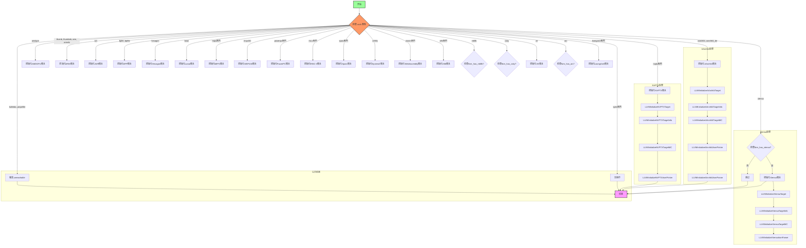

好的，我现在需要帮用户把给定的Zig函数用Mermaid流程图画出来。首先，我需要理解这个函数的结构和逻辑。函数名为initializeLLVMTarget，根据传入的arch参数（CPU架构）来初始化不同的LLVM目标。看起来每个case都对应不同的架构，并调用相应的LLVM初始化函数。

首先，我要确定流程图的大致结构。这个函数的主体是一个switch语句，根据不同的arch执行不同的初始化代码块。每个case可能有多个架构分支，比如.aarch64和.aarch64_be合并处理。另外，有些case里还有条件判断，比如build_options.llvm_has_xtensa等，这可能需要不同的处理路径。

接下来，我需要考虑如何将这些switch case转化为流程图的节点和分支。每个case可以作为一个条件判断节点，然后连接到对应的初始化步骤。需要注意的是，有些case内部还有条件判断（如if语句），这可能需要子流程来处理。

另外，注释中提到某些LLVM初始化函数不存在，比如NVPTX的AsmParser，Xtensa的AsmPrinter等，这些在流程图中是否需要特别标注？或者只是简单地省略对应的步骤？可能需要根据用户需求决定，但用户可能希望流程图准确反映代码中的调用情况，包括注释说明的部分。

可能的结构是：开始 -> 判断arch类型 -> 各分支处理 -> 结束。每个分支处理包括多个LLVM初始化函数的调用，以及可能的条件检查。对于有条件的部分（如if (build_options.llvm_has_xtensa)），可能需要两个分支：条件成立时执行某些调用，否则跳过。

需要注意的是，Mermaid的流程图语法中，条件判断通常用菱形节点，处理步骤用矩形节点。每个case分支可能需要一个条件节点，然后连接到相应的处理步骤。对于包含内部if条件的case，比如.xtensa，需要在处理步骤中加入子条件判断。

另外，最后的几个case，如.spirv、.kalimba等，处理方式不同（有的空操作，有的unreachable），这些也需要在流程图中体现。

现在，我需要组织这些思路，确保流程图清晰展示每个可能的arch分支及其处理流程，包括条件判断和函数调用。同时，保持流程图的简洁性，避免过于复杂。

可能的步骤如下：

1. 开始节点。
2. 判断arch类型，每个case对应一个分支。
3. 每个分支内部按顺序调用相应的LLVM初始化函数。
4. 对于有条件判断的分支（如xtensa），在内部添加条件节点，根据条件是否成立执行不同的操作。
5. 处理完每个case后，流程结束。
6. 对于无法处理或不需要处理的arch（如.spirv），直接结束或执行空操作。
7. 对于unreachable的情况，可能需要标记为错误或终止节点。

现在，需要考虑如何用Mermaid语法实现这些结构。例如，使用switch中的各个case作为不同的条件分支，每个分支包含多个操作步骤，以及可能的子条件判断。

在绘制时，可能需要将每个case作为单独的分支，从判断节点分出多个箭头指向不同的处理块。处理块内部按顺序列出函数调用。对于有if条件的，如xtensa，处理块内部分为条件判断，成立则执行某些调用，否则跳过。

最后，确保所有分支最终汇聚到结束节点，或者在适当的位置结束流程。
================================================

注：为保持简洁，图中仅展开展示了AArch64/NVPTX/Xtensa三个典型分支的详细流程，其他架构分支的处理模式类似（调用对应LLVM初始化函数）。带有条件检查的分支（如xtensa/m68k/csky/arc）都包含类似Xtensa处理子图中的条件判断结构。