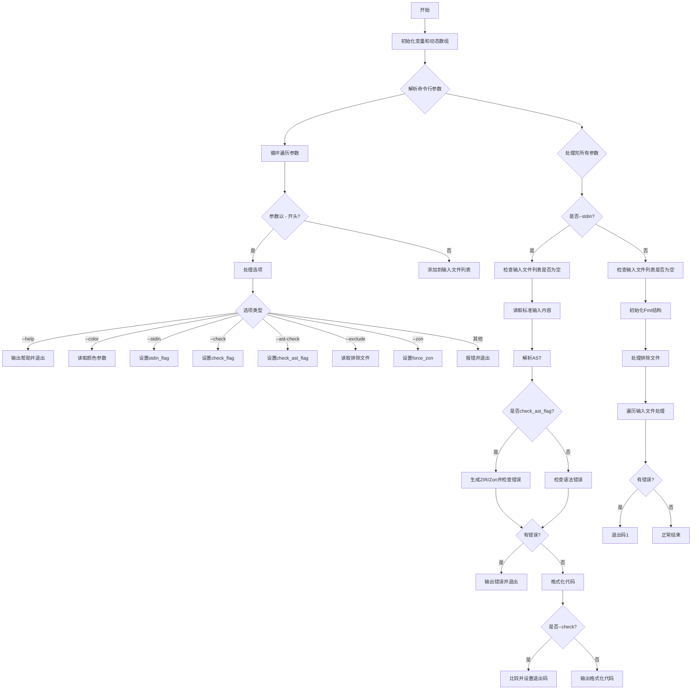

好的，我需要为这个Zig函数绘制流程图。首先，我需要理解这个函数的功能。看起来这是一个处理命令行参数、格式化代码或进行语法检查的工具，可能与zig fmt相关。

首先，函数接收三个参数：gpa（内存分配器）、arena（另一个内存分配器）和args（命令行参数数组）。然后定义了一些变量，比如颜色选项、标准输入标志、检查标志等。接着使用两个动态数组来存储输入文件和排除的文件。

然后，函数开始解析命令行参数。这里有一个循环，遍历所有参数。参数以“-”开头的是选项，比如--help、--color、--stdin等。不同的选项会设置不同的标志或处理参数。比如--color后面需要跟一个参数，所以会检查下一个参数是否存在，并转换颜色选项。如果遇到无法识别的参数，会报错。对于非选项参数，添加到输入文件列表中。

处理完参数后，检查是否启用了--stdin。如果是，就不能有输入文件，否则报错。然后从标准输入读取源代码，解析为AST（抽象语法树）。根据是否启用检查AST的标志，进行不同的处理，比如生成ZIR或Zon，并检查编译错误。如果有错误，渲染错误信息并退出。如果没有错误，格式化代码并根据--check标志比较是否与原代码一致，退出码根据结果决定。

如果没有使用--stdin，检查是否有输入文件，没有则报错。然后初始化一个Fmt结构体，处理排除的文件，将它们的inode记录到已见集合中，避免重复处理。最后遍历所有输入文件，处理每个路径，如果有错误则退出。

接下来，我需要将这个过程转化为流程图。流程图的步骤大致如下：

1. 开始
2. 初始化变量和动态数组
3. 解析命令行参数：
   a. 循环遍历每个参数
   b. 处理选项（如--help、--color、--stdin等）
   c. 处理非选项参数添加到输入文件列表
4. 处理--stdin的情况：
   a. 检查是否有输入文件冲突
   b. 读取标准输入内容
   c. 解析AST
   d. 检查AST或语法错误
   e. 格式化并输出或检查
5. 处理文件输入的情况：
   a. 检查是否有输入文件
   b. 初始化Fmt结构
   c. 处理排除文件
   d. 遍历处理每个输入文件
6. 根据是否有错误退出

需要注意条件分支，比如参数的不同选项、是否启用--stdin、是否有错误等。每一步的判断和可能的退出点都需要在流程图中体现。使用Mermaid的流程图语法来表示这些步骤和分支。
================================================
