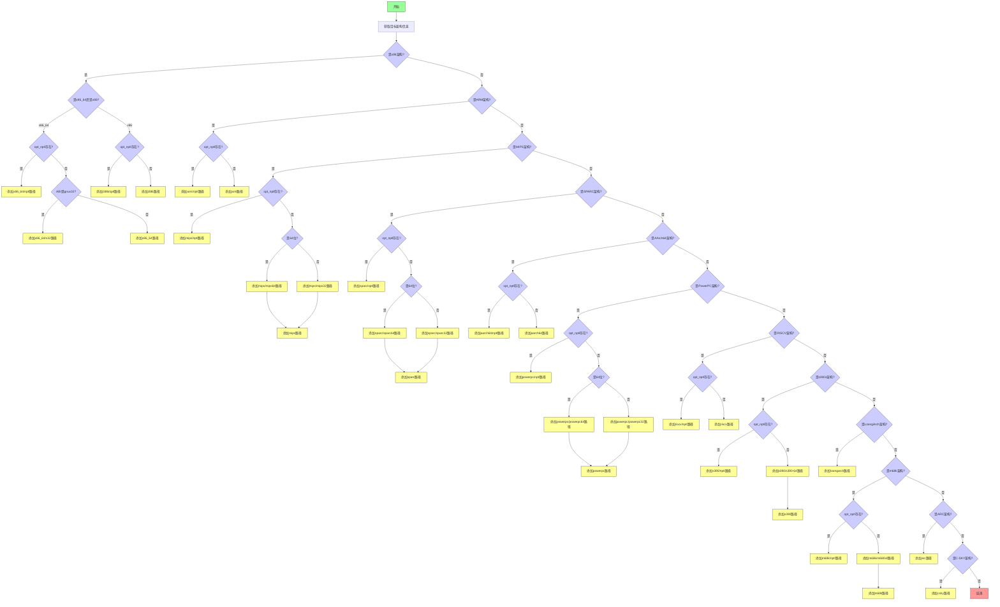

嗯，我现在要帮用户把给出的Zig函数用Mermaid画出流程图。首先，我需要仔细阅读这段代码，理解它的逻辑结构。这个函数叫做add_include_dirs_arch，主要作用是根据不同的CPU架构和目标参数，向args列表中添加包含目录的路径。

首先，函数开始部分声明了一些变量，比如arch、is_x86、is_aarch64等，这些都是用来判断目标架构的。然后根据不同的架构条件分支处理不同的路径。每个条件分支下，又会根据opt_nptl是否存在来决定具体的路径组合。比如，如果是x86_64架构，并且有nptl参数，就会生成不同的路径。

接下来，我需要将这个过程转化为流程图。流程图通常从开始节点开始，然后是判断条件，根据不同的条件走向不同的处理分支。每个分支内部可能还有进一步的判断，比如是否提供了nptl参数，或者是否是64位系统等。

需要注意的是，代码中有多个条件判断，比如if (is_x86)之后又分x86_64和x86的情况，接着还有对opt_nptl的判断。而其他架构如ARM、MIPS、SPARC等也有类似的结构。每个架构的处理逻辑可能包含多个步骤，比如添加多个包含路径。

我需要确保流程图能清晰地展示这些嵌套的条件判断和对应的操作。例如，对于x86架构，先判断是否是x86_64，再判断是否有nptl，或者是否是gnux32 ABI。然后根据不同的情况添加相应的路径到args列表中。

另外，在Mermaid语法中，条件判断通常用菱形节点表示，操作用矩形节点。每个条件分支需要用箭头连接，并标明条件结果（如“是”或“否”）。对于每个处理步骤，如“添加路径”，需要明确写出具体的操作内容。

需要注意的是，有些架构的处理逻辑可能比较复杂，比如MIPS和SPARC，它们不仅判断nptl，还根据是否是64位系统来决定子路径。这种情况下，流程图需要分层次展示这些嵌套的条件。

可能遇到的困难是如何简洁地表达多个嵌套的条件而不让流程图变得过于复杂。可能需要将某些重复的逻辑合并，或者使用子流程来表示。不过，根据用户的要求，可能需要一个整体的流程图，而不是分解成子图。

另外，还需要注意代码中的路径拼接部分，比如使用path.join函数来组合目录路径。这些细节在流程图中可能需要简化，只说明添加了哪个路径，而不必展示具体的字符串拼接过程。

总结一下，流程图的步骤大概是：

1. 开始
2. 获取目标架构信息
3. 根据架构类型进入不同的分支（x86, ARM, MIPS等）
4. 在每个架构分支中，判断是否有nptl参数
5. 根据不同的条件添加相应的包含路径到args
6. 结束

对于每个架构的处理，可能需要多个判断节点和操作节点。需要确保每个条件分支都被正确覆盖，并且路径添加的操作准确对应代码中的逻辑。

现在，我需要将这些思考转化为Mermaid的流程图语法，确保结构正确，逻辑清晰。
================================================
