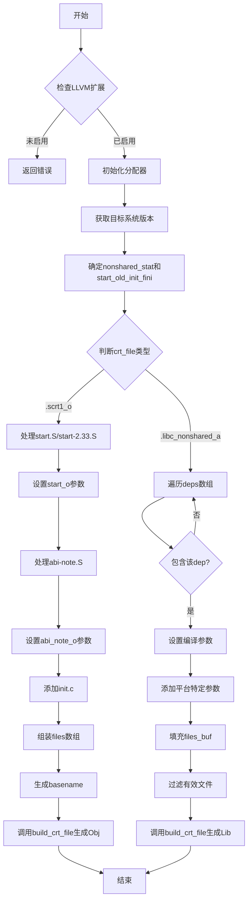

嗯，用户让我用Mermaid画出一个Zig函数的流程图。首先，我需要仔细阅读并理解这个函数的逻辑。函数名为buildCrtFile，看起来是用于构建Glibc的某些C运行时文件。代码中有很多条件判断和不同的分支，特别是处理不同的crt_file类型，比如.scrt1_o和.libc_nonshared_a。

首先，函数开始检查是否启用了LLVM扩展，如果没有，就返回错误。然后初始化一些分配器，获取目标系统的版本信息。接着根据不同的crt_file类型执行不同的代码块。对于.scrt1_o的情况，会处理多个源文件，如start.S、abi-note.S和init.c，然后调用comp.build_crt_file生成目标文件。对于.libc_nonshared_a的情况，会处理一系列依赖项，根据条件包含不同的源文件，并设置不同的编译参数，最后同样调用comp.build_crt_file生成静态库。

我需要将这个过程分解成流程图的主要步骤。可能的步骤包括：检查LLVM、初始化分配器、获取目标版本、判断条件（如nonshared_stat和start_old_init_fini）、根据crt_file类型分支处理不同的源文件和编译参数，最后调用build_crt_file生成输出。

需要注意的是条件判断和循环结构，比如在.libc_nonshared_a分支中遍历deps数组，并根据dep.include决定是否包含某个文件。这部分在流程图中可能需要用循环和条件节点来表示。

另外，函数中有多个子块（如blk:定义start_o和abi_note_o），这些子块的处理可以视为子流程。但为了简化流程图，可能需要将它们合并到主流程中，用步骤节点表示。

在绘制Mermaid流程图时，需要使用合适的节点（如矩形表示操作，菱形表示判断）和箭头连接各个步骤。确保每个分支（如switch case）都有清晰的路径，并且循环结构正确表示。

可能需要分两部分处理，分别对应两个crt_file的情况，每个部分内部处理各自的源文件和参数设置。最后统一调用build_crt_file。需要确认每个步骤的顺序和条件，避免遗漏关键判断点。

总结下来，流程图的步骤大致如下：
1. 检查LLVM扩展是否存在。
2. 初始化分配器和获取目标信息。
3. 确定nonshared_stat和start_old_init_fini的值。
4. 根据crt_file类型进入不同的分支。
   a. 如果是.scrt1_o，处理三个源文件，设置参数，生成目标文件。
   b. 如果是.libc_nonshared_a，遍历deps，根据条件包含文件，设置参数，生成静态库。
5. 调用build_crt_file生成最终文件。

需要确保每个条件判断和循环在流程图中正确体现，可能使用子图来组织不同的分支，使流程图更清晰。
================================================
