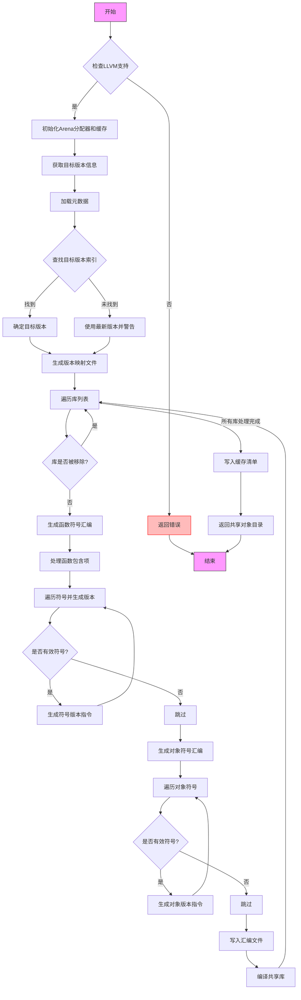

好的，我需要为提供的Zig函数`buildSharedObjects`绘制一个流程图。首先，我需要理解这个函数的主要逻辑和各个步骤。让我先仔细阅读代码，了解每个部分的作用。

函数一开始进行了一些初始化检查，比如检查是否启用了LLVM扩展，然后创建了arena分配器和缓存目录。接着，处理目标平台的版本信息，加载元数据，并确定目标版本。之后，生成共享对象的汇编代码，处理符号版本，最后编译生成共享库。

接下来，我需要将这个过程分解成流程图的主要步骤。可能的步骤包括：

1. 检查LLVM支持
2. 初始化缓存和目录
3. 处理目标版本和元数据
4. 生成符号版本映射文件
5. 生成汇编代码（处理函数和对象符号）
6. 编译共享库
7. 处理缓存和返回结果

在每个步骤中，可能会有条件判断，例如版本检查、是否存在缓存命中等。需要将这些条件分支体现在流程图中。

需要确保流程图的逻辑顺序正确，每个判断和循环都正确表示。例如，在加载元数据时，查找目标版本是否存在，如果不存在则使用最新版本。还有在处理符号时，可能存在多个版本需要处理，需要循环遍历。

另外，代码中有多个循环结构，比如处理函数包含和对象包含的部分，这些循环需要在流程图中明确表示。

最后，生成流程图时，使用Mermaid的语法，正确使用节点、条件判断、循环和子流程。确保每个步骤的描述简洁明了，逻辑清晰。

现在，我需要将这些思考转化为Mermaid流程图的具体结构。可能需要将大的步骤分解为子图，以便更好地组织流程。例如，生成汇编代码可以作为一个子流程，包含处理函数符号和对象符号的两个子步骤。

在绘制过程中，需要注意代码中的错误处理和提前返回的情况，比如缓存命中的情况下直接返回，或者遇到无效版本时的错误处理。这些也需要在流程图中体现出来，可能使用不同的路径表示正常流程和错误路径。

总结来说，流程图的绘制需要准确反映代码的执行顺序、条件分支和循环结构，同时保持清晰和易于理解。
================================================

这个流程图主要特点：
1. 使用菱形节点表示条件判断
2. 使用圆角矩形表示关键操作步骤
3. 用黄色背景突出显示错误路径
4. 包含循环处理结构（库列表遍历、符号遍历）
5. 区分函数符号和对象符号处理流程
6. 保留了原始代码的核心逻辑结构（版本处理、缓存管理、汇编生成）
7. 使用不同颜色标记开始/结束节点

流程图中特别处理了：
- LLVM依赖检查
- 目标版本匹配逻辑
- 符号版本选择机制
- 汇编文件生成细节
- 多库循环处理结构
- 缓存管理流程