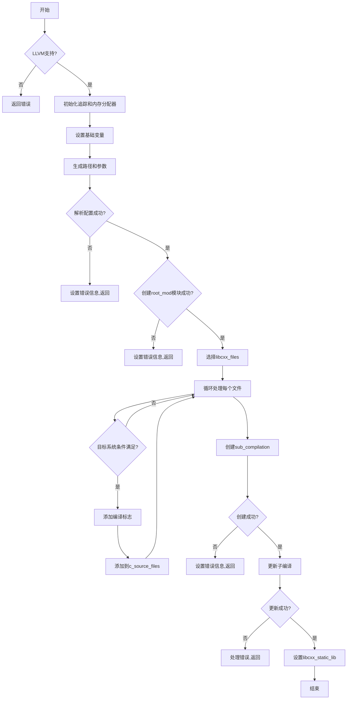

嗯，我现在需要分析这个Zig函数`buildLibCxx`的流程图。这个函数看起来是用来构建libc++库的。首先，我应该理解这个函数的大致结构，然后分解每个步骤，看看它们之间的流程关系。

首先，函数开始时检查是否有LLVM支持，如果没有就返回错误。这部分应该是一个条件判断，流程的第一个分支。接下来，初始化一些追踪和内存分配器，这部分是顺序执行的步骤。然后，设置一些变量，比如`root_name`、`output_mode`等，这些变量可能在后续步骤中使用。

接下来，处理一些路径和参数，比如`cxxabi_include_path`、`abi_version_arg`等。这里可能会有错误处理，比如`try`关键字表示可能的错误，需要处理错误返回的情况。然后，配置`config`变量，这可能涉及解析一些选项，如果失败的话，设置错误信息并返回。

创建`root_mod`模块的部分看起来比较复杂，可能涉及到多个参数的设置和错误处理。如果创建失败，同样需要返回错误。然后处理`libcxx_files`，根据条件选择不同的文件集合。这里有一个条件判断，根据`comp.config.any_non_single_threaded`来选择不同的文件列表。

接下来是循环处理每个C++源文件，添加编译标志。这里有很多条件判断，比如根据目标操作系统和ABI来排除某些文件，或者添加特定的编译选项。每个文件处理完成后，添加到`c_source_files`列表中。

之后，创建子编译`sub_compilation`，这里也可能出错，需要处理错误。最后，更新子编译，处理可能的错误，并设置最终的静态库文件。

现在，我需要将这些步骤转化为流程图。流程图中需要包括主要的条件判断、循环处理、错误处理路径，以及各步骤之间的顺序关系。例如：

1. 开始
2. 检查LLVM支持 → 否 → 返回错误
3. 初始化追踪和内存分配器
4. 设置基础变量（root_name, output_mode等）
5. 生成路径和参数（cxxabi_include_path等）
6. 解析配置config → 错误 → 设置失败信息并返回
7. 创建root_mod模块 → 错误 → 设置失败信息并返回
8. 选择libcxx_files
9. 循环处理每个cxx_src文件：
   a. 检查目标系统条件，决定是否跳过文件
   b. 添加编译标志
   c. 添加到c_source_files
10. 创建sub_compilation → 错误 → 设置失败信息并返回
11. 更新子编译 → 错误 → 处理错误并返回
12. 设置libcxx_static_lib并结束

需要注意错误处理的路径，每个可能出错的地方都需要有对应的错误处理分支。另外，循环处理文件的部分需要表示为循环结构。可能需要使用Mermaid的分支、循环、子程序等结构来表示。

在绘制流程图时，应该将主要的条件判断作为分支节点，循环作为循环节点，错误处理作为单独的分支。同时，确保各步骤之间的箭头正确连接，表示执行顺序。
================================================
