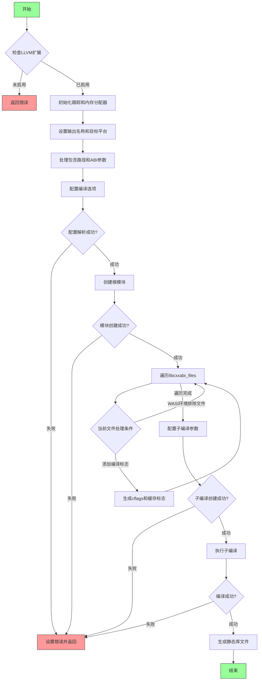

好的，我现在需要为提供的Zig函数`buildLibCxxAbi`绘制一个流程图。首先，我需要仔细阅读代码，理解其结构和各个步骤。函数的主要功能似乎是构建libcxxabi库，处理各种配置和编译选项。

首先，函数开始检查是否启用了LLVM扩展，如果没有则返回错误。接下来初始化一些跟踪和内存分配器。然后设置输出名称、目标平台等信息，处理包含路径和ABI版本参数。接着配置编译选项，比如优化模式、strip设置、异常处理等。

然后创建根模块（root_mod），处理C源文件列表，根据不同的目标平台添加不同的编译标志。特别是针对WASI和非单线程环境进行条件判断，添加或排除某些源文件和编译选项。之后配置子编译（sub_compilation），设置各种路径和参数，最后执行编译并处理可能的错误。

在绘制流程图时，需要将这些步骤分解成不同的节点，并按照执行顺序连接起来。需要注意条件分支，比如针对不同操作系统或ABI的处理，以及错误处理路径。可能需要使用菱形节点表示条件判断，矩形节点表示操作步骤，箭头表示流程方向。

需要确保每个主要步骤都被正确表示，例如初始化、配置、编译、错误处理等。同时要注意循环结构，比如遍历`libcxxabi_files`时的循环处理。此外，函数中涉及的多个子过程和函数调用（如`Compilation.create`、`sub_compilation.destroy()`）也需要适当体现。

可能遇到的挑战是如何简洁地表达复杂的条件逻辑和循环，同时保持流程图的清晰易懂。需要合理分组相关步骤，避免节点过多导致混乱。另外，错误处理路径也需要明确标出，显示何时会返回错误或继续执行。

最后，生成Mermaid代码时，要确保语法正确，节点和连接符使用正确，例如使用`-->`表示流程方向，条件判断使用`if{条件}`和`else`分支。可能需要使用子图来组织复杂的部分，如循环处理C源文件的部分。
================================================
